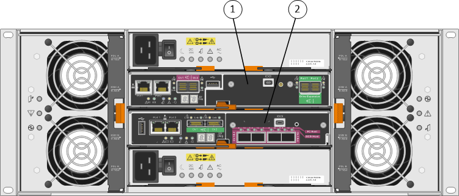

= SG5600 appliances - Overview
:icons: font
:imagesdir: ../media/

[.lead]
The StorageGRID SG5600 appliance is an integrated storage and computing platform that operates as a Storage Node in a StorageGRID grid.

The StorageGRID SG5600 appliance includes the following components:

[options="header"]
|===
| Component| Description
a|
E5600SG controller
a|
Compute serverThe E5600SG controller runs the Linux operating system and the StorageGRID software.

This controller connects to the following:

* The Admin, Grid, and Client Networks for the StorageGRID system
* The E2700 controller, using dual SAS paths (active/active) with the E5600SG controller operating as the initiator

a|
E2700 controller
a|
Storage controllerThe E2700 controller operates as a standard E-Series storage array in simplex mode, and runs the SANtricity operating system (controller firmware).

This controller connects to the following:

* The management network where SANtricity Storage Manager is installed
* The E5600SG controller, using dual SAS paths (active/active) with the E2700 controller operating as the target

|===
The SG5600 appliance also includes the following components, depending on the model:

[options="header"]
|===
| Component| Model SG5612| Model SG5660
a|
Drives
a|
12 NL-SAS drives
a|
60 NL-SAS drives
a|
Enclosure
a|
DE1600 enclosure, a two rack-unit (2U) chassis that houses the drives and the controllers
a|
DE6600 enclosure, a four rack-unit (4U) chassis that houses the drives and the controllers
a|
Power supplies and fans
a|
Two power-fan canisters
a|
Two power supplies and two fans
|===

NOTE: The E5600SG controller is highly customized for use in the StorageGRID appliance. All other components operate as described in E-Series documentation, except as indicated in these instructions.

The maximum raw storage available on each StorageGRID appliance Storage Node is fixed, based on the appliance model and configuration. You cannot expand the available storage by adding a shelf with additional drives.

== StorageGRID appliance features

The StorageGRID SG5600 appliance provides an integrated storage solution for creating a new StorageGRID system or for expanding the capacity of an existing system.

The StorageGRID appliance provides the following features:

* Combines the StorageGRID Storage Node computing and storage elements into a single, efficient, integrated solution
* Simplifies the installation and configuration of a Storage Node, automating most of the process required
* Provides a high-density storage solution with two enclosure options: one that is 2U and one that is 4U
* Uses 10-GbE IP interfaces directly to the Storage Node, without the need for intermediate storage interfaces such as FC or iSCSI
* Can be used in a hybrid grid environment that uses StorageGRID appliances and virtual (software-based) Storage Nodes
* Includes preconfigured storage and comes preloaded with the StorageGRID Appliance Installer (on the E5600SG controller) for field-ready software deployment and integration

== Hardware diagrams

The SG5612 and SG5660 models of the StorageGRID appliance both include an E2700 controller and an E5600SG controller. You should review the diagrams to learn the differences between the models and the controllers.

=== Model SG5612 2U: Rear view of E2700 controller and E5600SG controller

image::../media/sg5612_2u_rear_view.gif[Back view of SG5612 with two controllers]

[options="header"]
|===
| Callout| Description
a|
1
a|
E2700 controller
a|
2
a|
E5600SG controller
|===

=== Model SG5660 4U: Rear view of E2700 controller and E5600SG controller

The E2700 controller is above the E5600SG controller.

[options="header"]
|===
| Callout| Description
a|
1
a|
E2700 controller
a|
2
a|
E5600SG controller
|===

=== Rear view of E2700 controller

image::../media/sga_controller_2700_diagram_callouts.gif[E2700 diagram]

[options="header"]
|===
| Callout| Description
a|
1
a|
Management port 1 (Connect to the network where SANtricity Storage Manager is installed.)
a|
2
a|
Management port 2 (Use during installation to connect to a laptop.)
a|
3
a|
SAS interconnect port 1
a|
4
a|
SAS interconnect port 2
a|
5
a|
Serial connection port
a|
6
a|
Seven-segment display
|===

NOTE: The two SAS ports labeled Drive Expansion (green) on the rear of the E2700 controller are not used. The StorageGRID appliance does not support expansion drive shelves.

=== Rear view of E5600SG controller

image::../media/sga_controller_5600_diagram_callouts.gif[E5600 diagram]

[options="header"]
|===
| Callout| Description
a|
1
a|
Management port 1Connect to the Admin network for StorageGRID.

a|
2
a|
Management port 2 Options:

* Bond with management port 1 for a redundant connection to the Admin Network for StorageGRID.
* Leave unwired and available for temporary local access (IP 169.254.0.1).
* During installation, use for IP configuration if DHCP-assigned IP addresses are not available.

a|
3
a|
SAS interconnect port 1
a|
4
a|
SAS interconnect port 2
a|
5
a|
Fault and Active LEDs for 10-GbE network port 1
a|
6
a|
Fault and Active LEDs for 10-GbE network port 2
a|
7
a|
Fault and Active LEDs for 10-GbE network port 3
a|
8
a|
Fault and Active LEDs for 10-GbE network port 4
a|
9
a|
Needs Attention LED
a|
10
a|
Seven-segment display
a|
11
a|
10-GbE network port 1
a|
12
a|
10-GbE network port 2
a|
13
a|
10-GbE network port 3
a|
14
a|
10-GbE network port 4
|===

NOTE: The host interface card (HIC) on the StorageGRID appliance E5600SG controller supports only 10-Gb Ethernet connections. It cannot be used for iSCSI connections.
