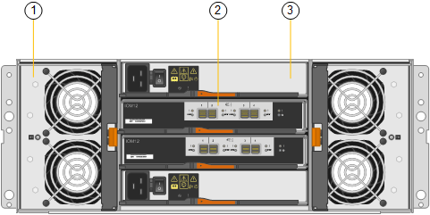

= SG6000 appliances: Overview
:icons: font
:imagesdir: ../media/

[.lead]
The StorageGRID SG6000 appliances are integrated storage and computing platforms that operate as Storage Nodes in a StorageGRID system. These appliances can be used in a hybrid grid environment that combines appliance Storage Nodes and virtual (software-based) Storage Nodes.

The SG6000 appliances provide the following features:

* Available in two models:
 ** SG6060, which includes 60 drives and supports expansion shelves.
 ** SGF6024, which offers 24 solid state drives (SSDs).
* Integrate the storage and computing elements for a StorageGRID Storage Node.
* Include the StorageGRID Appliance Installer to simplify Storage Node deployment and configuration.
* Include SANtricity System Manager for managing and monitoring the storage controllers and drives.
* Include a baseboard management controller (BMC) for monitoring and diagnosing the hardware in the compute controller.
* Support up to four 10-GbE or 25-GbE connections to the StorageGRID Grid Network and Client Network.
* Support Federal Information Processing Standard (FIPS) drives. When these drives are used with the Drive Security feature in SANtricity System Manager, unauthorized access to data is prevented.

== SG6060 overview

The StorageGRID SG6060 appliance includes a compute controller and a storage controller shelf that contains two storage controllers and 60 drives. Optionally, 60-drive expansion shelves can be added to the appliance.

=== SG6060 components

The SG6060 appliance includes the following components:

[options="header"]
|===
| Component| Description
a|
Compute controller
a|
SG6000-CN controller, a one-rack unit (1U) server that includes:

* 40 cores (80 threads)
* 192 GB RAM
* Up to 4 × 25 Gbps aggregate Ethernet bandwidth
* 4 × 16 Gbps Fibre Channel (FC) interconnect
* Baseboard management controller (BMC) that simplifies hardware management
* Redundant power supplies

a|
Storage controller shelf
a|
E-Series E2860 controller shelf (storage array), a 4U shelf that includes:

* Two E-Series E2800 controllers (duplex configuration) to provide storage controller failover support
* Five-drawer drive shelf that holds sixty 3.5-inch drives (2 solid-state drives, or SSDs, and 58 NL-SAS drives)
* Redundant power supplies and fans

a|
Optional: Storage expansion shelves

*Note:* Expansion shelves can be installed during initial deployment or added later.

a|
E-Series DE460C enclosure, a 4U shelf that includes:

* Two input/output modules (IOMs)
* Five drawers, each holding 12 NL-SAS drives, for a total of 60 drives
* Redundant power supplies and fans

Each SG6060 appliance can have one or two expansion shelves for a total of 180 drives.

|===

=== SG6060 diagrams

This figure shows the front of the SG6060, which includes a 1U compute controller and a 4U shelf containing two storage controllers and 60 drives in five drive drawers.

image::../media/sg6060_front_view_with_and_without_bezels.gif[SG6060 Front View]

[options="header"]
|===
| Callout| Description
a|
1
a|
SG6000-CN compute controller with front bezel
a|
2
a|
E2860 controller shelf with front bezel (optional expansion shelf appears identical)
a|
3
a|
SG6000-CN compute controller with front bezel removed
a|
4
a|
E2860 controller shelf with front bezel removed (optional expansion shelf appears identical)
|===
This figure shows the back of the SG6060, including the compute and storage controllers, fans, and power supplies.

image::../media/sg6060_rear_view.gif[SG6060 Rear View]

[options="header"]
|===
| Callout| Description
a|
1
a|
Power supply (1 of 2) for SG6000-CN compute controller
a|
2
a|
Connectors for SG6000-CN compute controller
a|
3
a|
Fan (1 of 2) for E2860 controller shelf
a|
4
a|
E-Series E2800 storage controller (1 of 2) and connectors
a|
5
a|
Power supply (1 of 2) for E2860 controller shelf
|===
This figure shows the back of the optional expansion shelf for the SG6060, including the input/output modules (IOMs), fans, and power supplies. Each SG6060 can be installed with one or two expansion shelves, which can be included in the initial installation or added later.

[options="header"]
|===
| Callout| Description
a|
1
a|
Fan (1 of 2) for expansion shelf
a|
2
a|
IOM (1 of 2) for expansion shelf
a|
3
a|
Power supply (1 of 2) for expansion shelf
|===

== SGF6024 overview

The StorageGRIDSGF6024 includes a compute controller and a storage controller shelf that holds 24 solid state drives.

=== SGF6024 components

The SGF6024 appliance includes the following components:

[options="header"]
|===
| Component| Description
a|
Compute controller
a|
SG6000-CN controller, a one-rack unit (1U) server that includes:

* 40 cores (80 threads)
* 192 GB RAM
* Up to 4 × 25 Gbps aggregate Ethernet bandwidth
* 4 × 16 Gbps Fibre Channel (FC) interconnect
* Baseboard management controller (BMC) that simplifies hardware management
* Redundant power supplies

a|
Flash array (controller shelf)
a|
E-Series EF570 flash array (also known as a controller shelf), a 2U shelf that includes:

* Two E-Series EF570 controllers (duplex configuration) to provide storage controller failover support
* 24 solid state drives (also known as SSDs or flash drives)
* Redundant power supplies and fans

|===

=== SGF6024 diagrams

This figure shows the front of the SGF6024, which includes a 1U compute controller and a 2U enclosure containing two storage controllers and 24 flash drives.

image::../media/sgf6024_front_view_with_and_without_bezels.png[SG6024 Front Views]

[options="header"]
|===
| Callout| Description
a|
1
a|
SG6000-CN compute controller with front bezel
a|
2
a|
EF570 flash array with front bezel
a|
3
a|
SG6000-CN compute controller with front bezel removed
a|
4
a|
EF570 flash array with front bezel removed
|===
This figure shows the back of the SGF6024, including the compute and storage controllers, fans, and power supplies.

image::../media/sgf6024_rear_view.gif[SG6024 Rear]

[options="header"]
|===
| Callout| Description
a|
1
a|
Power supply (1 of 2) for SG6000-CN compute controller
a|
2
a|
Connectors for SG6000-CN compute controller
a|
3
a|
Power supply (1 of 2) for EF570 flash array
a|
4
a|
E-Series EF570 storage controller (1 of 2) and connectors
|===

== Controllers in SG6000 appliances

Each model of the StorageGRID SG6000 appliance includes an SG6000-CN compute controller in a 1U enclosure and duplex E-Series storage controllers in a 2U or 4U enclosure, depending on the model. Review the diagrams to learn more about each type of controller.

=== All appliances: SG6000-CN compute controller

* Provides compute resources for the appliance.
* Includes the StorageGRID Appliance Installer.
+
NOTE: StorageGRID software is not preinstalled on the appliance. This software is retrieved from the Admin Node when you deploy the appliance.

* Can connect to all three StorageGRID networks, including the Grid Network, the Admin Network, and the Client Network.
* Connects to the E-Series storage controllers and operates as the initiator.

This figure shows the connectors on the back of the SG6000-CN.

image::../media/sg6000_cn_rear_connectors.gif[SG6000-CN Rear Connectors]

[options="header"]
|===
|  | Port| Type| Use
a|
1
a|
Interconnect ports 1-4
a|
16-Gb/s Fibre Channel (FC), with integrated optics
a|
Connect the SG6000-CN controller to the E2800 controllers (two connections to each E2800).
a|
2
a|
Network ports 1-4
a|
10-GbE or 25-GbE, based on cable or SFP transceiver type, switch speed, and configured link speed
a|
Connect to the Grid Network and the Client Network for StorageGRID.
a|
3
a|
BMC management port
a|
1-GbE (RJ-45)
a|
Connect to the SG6000-CN baseboard management controller.
a|
4
a|
Diagnostic and support ports
a|

* VGA
* Serial, 115200 8-N-1
* USB

a|
Reserved for technical support use.
a|
5
a|
Admin Network port 1
a|
1-GbE (RJ-45)
a|
Connect the SG6000-CN to the Admin Network for StorageGRID.
a|
6
a|
Admin Network port 2
a|
1-GbE (RJ-45)
a|
Options:

* Bond with management port 1 for a redundant connection to the Admin Network for StorageGRID.
* Leave unwired and available for temporary local access (IP 169.254.0.1).
* During installation, use port 2 for IP configuration if DHCP-assigned IP addresses are not available.

|===

=== SG6060: E2800 storage controllers

* Two controllers for failover support.
* Manage the storage of data on the drives.
* Function as standard E-Series controllers in a duplex configuration.
* Include SANtricity OS Software (controller firmware).
* Include SANtricity System Manager for monitoring storage hardware and for managing alerts, the AutoSupport feature, and the Drive Security feature.
* Connect to the SG6000-CN controller and provide access to the storage.

This figure shows the connectors on the back of each of the E2800 controllers.

image::../media/e2800_controller_with_callouts.gif[Connectors on E2800 controller]

[options="header"]
|===
|  | Port| Type| Use
a|
1
a|
Interconnect ports 1 and 2
a|
16-Gb/s FC optical SFPa|
Connect each of the E2800 controllers to the SG6000-CN controller.

There are four connections to the SG6000-CN controller (two from each E2800).
a|
2
a|
Management ports 1 and 2
a|
1-Gb (RJ-45) Ethernet
a|

* Port 1 Options:
** Connect to a management network to enable direct TCP/IP access to SANtricity System Manager
** Leave unwired to save a switch port and IP address.  Access SANtricity System Manager using the Grid Manager or Storage Grid Appliance Installer UIs.  

*Note*: some optional SANtricity functionality, such as NTP sync for accurate log timestamps, is not available when you choose to leave Port 1 unwired.

*Note*: StorageGRID 11.5 or greater, and SANtricity 11.70 or greater, are required when you leave Port 1 unwired.

* Port 2 is reserved for technical support use.

a|
3
a|
Diagnostic and support ports
a|

* RJ-45 serial port
* Micro USB serial port
* USB port

a|
Reserved for technical support use.
a|
4
a|
Drive expansion ports 1 and 2
a|
12Gb/s SAS
a|
Connect the ports to the drive expansion ports on the IOMs in the expansion shelf.
|===

=== SGF6024: EF570 storage controllers

* Two controllers for failover support.
* Manage the storage of data on the drives.
* Function as standard E-Series controllers in a duplex configuration.
* Include SANtricity OS Software (controller firmware).
* Include SANtricity System Manager for monitoring storage hardware and for managing alerts, the AutoSupport feature, and the Drive Security feature.
* Connect to the SG6000-CN controller and provide access to the flash storage.

This figure shows the connectors on the back of each of the EF570 controllers.

image::../media/ef570_rear_connectors.gif[EF570 Rear Connectors]

[options="header"]
|===
|  | Port| Type| Use
a|
1
a|
Interconnect ports 1 and 2
a|
16-Gb/s FC optical SFPa|
Connect each of the EF570 controllers to the SG6000-CN controller.

There are four connections to the SG6000-CN controller (two from each EF570).
a|
2
a|
Diagnostic and support ports
a|

* RJ-45 serial port
* Micro USB serial port
* USB port

a|
Reserved for technical support use.
a|
3
a|
Drive expansion ports
a|
12Gb/s SAS
a|
Not used. The SGF6024 appliance does not support expansion drive shelves.
a|
4
a|
Management ports 1 and 2
a|
1-Gb (RJ-45) Ethernet
a|

* Port 1 connects to the network where you access SANtricity System Manager on a browser.
* Port 2 is reserved for technical support use.

|===

=== SG6060: Input/output modules for optional expansion shelves

The expansion shelf contains two input/output modules (IOMs) that connect to the storage controllers or to other expansion shelves.

image::../media/iom_connectors.gif[IOM Rear]

[options="header"]
|===
|  | Port| Type| Use
a|
1
a|
Drive expansion ports 1-4
a|
12Gb/s SAS
a|
Connect each port to the storage controllers or additional expansion shelf (if any).
|===
