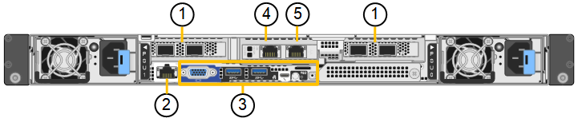

= SGF6112 appliance: Overview
:icons: font
:imagesdir: ../media/

[.lead]
The StorageGRID SGF6112 appliance operates as a Storage Node in a StorageGRID system. The appliance can be used in a hybrid grid environment that combines appliance Storage Nodes and virtual (software-based) Storage Nodes.

The SGF6112 appliance provide the following features:

* 12 NVMe (nonvolatile memory express) SSD drives with integrated compute and storage controllers. 
* Integrates the storage and computing elements for a StorageGRID Storage Node.
* Includes the StorageGRID Appliance Installer to simplify Storage Node deployment and configuration.
* Includes a baseboard management controller (BMC) for monitoring and diagnosing the hardware in the compute controller.
* Supports up to four 10-GbE or 25-GbE connections to the StorageGRID Grid Network and Client Network.

== SGF6112 hardware description
The StorageGRID SGF6112 is an all-flash appliance that features a compact design with compute controller and storage controller integrated into a 1 RU chassis. The appliance supports 12 SSD NVMe drives with a storage capacity of up to 15.3TB per drive.

=== Resilient object storage
The SGF6112 is designed with SSDs in a RAID that provides the following data protection features: 

* Ability to function after the failure of a single SSD with no impact on object availability.
* Ability to continue to function after multiple SSD failures with a minimum necessary reduction in object availability (based on the design of the underlying RAID scheme).
* Fully recoverable, while in service, from any number of SSD failures that do not result in extreme damage to the RAID housing the node's root volume (the StorageGRID operating system).

=== SGF6112 hardware components
The SGF6112 appliance includes the following components:

[cols="1a,2a" options="header"]
|===
| Component| Description
a|
Compute and storage platform
a|
A one-rack unit (1U) server that includes:

* Two 2.1/2.6GHz 165W processors providing 48 cores
* 256 GB RAM
* 2 × 1/10GBase-T ports
* 4 × 10/25GbE Ethernet ports
* 1 × 256GB Internal Boot drive (includes StorageGRID software) 
* Baseboard management controller (BMC) that simplifies hardware management
* TPM (Trusted Platform Module) that can be used to safely store certificates and keys
* Redundant power supplies and fans

|===

=== SGF6112 diagrams

This figure shows the front of the SGF6112 without the bezel. The appliance includes a 1U compute and storage platform that contains 12 SSD drives. 

*SGF6112 front view*

image::../media/sgf6112_front_with_ssds.png[SGF6112 Front View]

This figure shows the back of the SGF6112, including the ports, fans, and power supplies.

*SGF6112 rear view*

[options="header"]
|===
|  | Port| Type| Use
a|
1
a|
Network ports 1-4
a|
10/25-GbE, based on cable or SFP transceiver type (SFP28 and SFP+ modules are supported), switch speed, and configured link speed.  
a|
Connect to the Grid Network and the Client Network for StorageGRID.
a|
2
a|
BMC management port
a|
1-GbE (RJ-45)
a|
Connect to the appliance baseboard management controller.
a|
3
a|
Diagnostic and support ports
a|

* VGA
* USB
* Console port
* Micro-USB console port

a|
Reserved for technical support use.
a|
4
a|
Admin network port 1
a|
1/10-GbE (RJ-45)
a|
Connect the appliance to the Admin Network for StorageGRID.
a|
5
a|
Admin Network port 2
a|
1/10-GbE (RJ-45)
a|
Options:

* Bond with Admin network port 1 for a redundant connection to the Admin Network for StorageGRID.
* Leave disconnected and available for temporary local access (IP 169.254.0.1).
* During installation, use port 2 for IP configuration if DHCP-assigned IP addresses are not available.
|===