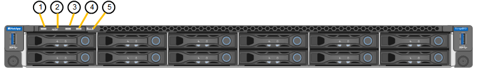

= View status indicators and codes
:icons: font
:imagesdir: ../media/

[.lead]
The appliances and controllers include indicators that help you determine the status of the appliance components.

[role="tabbed-block"]
====

.SGF6112
--

The appliance includes indicators that help you determine the status of the appliance controller and the SSDs:

* <<appliance_indicators_SG6100,Appliance indicators and buttons>>
* <<general_boot_codes_SG6100,General boot-up codes>>
* <<ssd_indicators_SG6100,SSD indicators>>

Use this information to help link:troubleshooting-hardware-installation-sg6100.html[troubleshoot SGF6112 hardware installation].

[[appliance_indicators_SG6100]]
*Appliance indicators and buttons*

[cols="1a,2a,3a" options="header"]
|===
| Callout | Display| State
| 1
| Power button
| * Blue: the appliance is powered on.
* Off: the appliance is powered off.

| 2
| Reset button
| Use this button to perform a hard reset of the controller.

| 3
| Identify button
| Using the BMC, this button can be set to blink, On (Solid), or Off.

* Blue, blinking: Identifies the appliance in the cabinet or rack.
* Blue, solid: Identifies the appliance in the cabinet or rack.
* Off: The appliance is not visually identifiable in the cabinet or rack.

| 4
| Status LED
| * Amber, solid: An error has occurred.
+
*Note:* To view the boot-up and error codes, link:accessing-bmc-interface.html[access the BMC interface].

* Off: No errors are present.

| 5
| PFR
| This light is not used by the SGF6112 appliance and remains off. 

|===

[[general_boot_codes_SG6100]]
*General boot-up codes*

During boot-up or after a hard reset of the appliance, the following occurs:

. The baseboard management controller (BMC) logs codes for the boot-up sequence, including any errors that occur.
. The power button lights up.
. If any errors occur during boot-up, the alarm LED lights up.
+
To view the boot-up and error codes, link:accessing-bmc-interface.html[access the BMC interface].

[[ssd_indicators_SG6100]]
*SSD indicators*

image::../media/ssd_indicators.png[SSD Indicators]

[cols="1a,2a,2a" options="header"]
|===
| LED| Display| State

| 1
| Drive status/fault
| * Blue (solid): drive is online
* Amber (solid): drive failure
* Off: slot is empty

*Note:* If a new working SSD is inserted into a working SGF6112 StorageGRID node, the LEDs on the SSD should blink initially, but stop blinking as soon as the system determines that the drive has enough capacity and is functional.

| 2
| Drive active
| Blue (blinking): drive is being accessed
|===
--

.SG6000
--

The SG6000 appliance controllers include indicators that help you determine the status of the appliance controller:

* <<status_indicators_sg6000cn,Status indicators and buttons on SG6000-CN controller>>
* <<general_boot_codes_sg6000,General boot-up codes>>
* <<boot_codes_sg6000_storage_controller,Boot-up status codes for SG6000 storage controllers>>

Use this information to help link:troubleshooting-hardware-installation.html[troubleshoot SG6000 installation].

[[status_indicators_sg6000cn]]
*Status indicators and buttons on SG6000-CN controller*

The SG6000-CN controller includes indicators that help you determine the status of the controller, including the following indicators and buttons.

image::../media/sg6000_cn_front_indicators.gif[Front Indicators - SG6000-CN]

[cols="1a,2a,3a" options="header"]
|===
| Callout  | Display| Description

| 1
| Power button
| * Blue: The controller is powered on.
* Off: The controller is powered off.

| 2
| Reset button
| _No indicator_

Use this button to perform a hard reset of the controller.

| 3
| Identify button
| 
* Blinking or solid blue: Identifies the controller in the cabinet or rack.
* Off: The controller is not visually identifiable in the cabinet or rack.

This button can be set to Blink, On (Solid), or Off.

| 4
| Alarm LED
| * Amber: An error has occurred.
+
*Note:* To view the boot-up and error codes, link:accessing-bmc-interface.html[access the BMC interface].
* Off: No errors are present.
|===

[[general_boot_codes_sg6000]]
*General boot-up codes*

During boot-up or after a hard reset of the SG6000-CN controller, the following occurs:

. The baseboard management controller (BMC) logs codes for the boot-up sequence, including any errors that occur.
. The power button lights up.
. If any errors occur during boot-up, the alarm LED lights up.
+
To view the boot-up and error codes, link:accessing-bmc-interface.html[access the BMC interface].

[[boot_codes_sg6000_storage_controller]]
*Boot-up status codes for SG6000 storage controllers*

Each storage controller has a seven-segment display that provides status codes as the controller powers up. The status codes are the same for both the E2800 controller and the EF570 controller.

For descriptions of these codes, see the E-Series system monitoring information for you storage controller type.

.Steps

. During boot-up, monitor progress by viewing the codes shown on the seven-segment display for each storage controller.
+
The seven-segment display on each storage controller shows the repeating sequence *OS*, *Sd*, `*_blank_*` to indicate that the controller is performing start-of-day processing.

. After the controllers have booted up, confirm that each storage controller shows 99, which is the default ID for an E-Series controller shelf.
+
Make sure this value is displayed on both storage controllers, as shown in this example E2800 controller.
+
image::../media/seven_segment_display_codes_for_e2800.gif[Seven-Segment Display Codes for E2800]

. If one or both controllers show other values, see link:troubleshooting-hardware-installation.html[Troubleshoot hardware installation (SG6000 or SG5700)] and confirm you completed the installation steps correctly. If you are unable to resolve the problem, contact technical support.

.Related information

* https://mysupport.netapp.com/site/global/dashboard[NetApp Support^]

* link:../sg6000/powering-on-sg6000-cn-controller-and-verifying-operation.html[Power on SG6000-CN controller and verify operation]
--

.SG5700
--

The appliance controllers include indicators that help you determine the status of the appliance controller:

* <<boot_codes_sg5700,SG5700 boot-up status codes>>
* <<status_indicators_e5700sg_controller,Status indicators on E5700SG controller>>
* <<general_boot_codes_sg5700,General boot-up codes>>
* <<boot_codes_e5700sg_controller,E5700SG controller boot-up codes>>
* <<error_codes_e5700sg_controller,E5700SG controller error codes>>

Use this information to help link:troubleshooting-hardware-installation.html[troubleshoot SG5700 hardware installation].

[[boot_codes_sg5700]]
*SG5700 boot-up status codes*

The seven-segment displays on each controller show status and error codes as the appliance powers up.

The E2800 controller and the E5700SG controller display different statuses and error codes.

To understand what these codes mean, see the following resources:

[cols="1a,2a" options="header"]
|===
| Controller| Reference

| E2800 controller
| _E5700 and E2800 System Monitoring Guide_

*Note:* The codes listed for the E-Series E5700 controller do not apply to the E5700SG controller in the appliance.

| E5700SG controller
| "`Status indicators on the E5700SG controller`"

|===

.Steps

. During boot-up, monitor progress by viewing the codes shown on the seven-segment displays.
 ** The seven-segment display on the E2800 controller shows the repeating sequence *OS*, *Sd*, `*_blank_*` to indicate that it is performing start-of-day processing.
 ** The seven-segment display on the E5700SG controller shows a sequence of codes, ending with *AA* and *FF*.
. After the controllers have booted up, confirm the seven-segment displays show the following:
+
image::../media/seven_segment_display_codes.gif[Seven-segment displays after controllers have booted up.]
+
[cols="1a,2a" options="header"]
|===
| Controller| Seven-segment display

| E2800 controller
| Shows 99, which is the default ID for an E-Series controller shelf.

| E5700SG controller
| Shows *HO*, followed by a repeating sequence of two numbers.

----
HO -- IP address for Admin Network -- IP address for Grid Network HO
----

In the sequence, the first set of numbers is the DHCP-assigned IP address for the controller's management port 1. This address is used to connect the controller to the Admin Network for StorageGRID. The second set of numbers is the DHCP-assigned IP address used to connect the appliance to the Grid Network for StorageGRID.

*Note:* If an IP address could not be assigned using DHCP, 0.0.0.0 is displayed.

|===

. If the seven-segment displays show other values, see link:troubleshooting-hardware-installation.html[Troubleshoot hardware installation (SG6000 or SG5700)] and confirm you completed the installation steps correctly. If you are unable to resolve the problem, contact technical support.

[[status_indicators_e5700sg_controller]]
*Status indicators on E5700SG controller*

The seven-segment display and the LEDs on the E5700SG controller show status and error codes while the appliance powers up and while the hardware is initializing. You can use these displays to determine status and troubleshoot errors.

After the StorageGRID Appliance Installer has started, you should periodically review the status indicators on the E5700SG controller.

image::../media/e5700sg_leds.gif[Status indicators on E5700SG controller]

[cols="1a,2a,2a" options="header"]
|===
| Callout | Display| Description

| 1
| Attention LED
| Amber: The controller is faulty and requires operator attention, or the installation script was not found.

Off: The controller is operating normally.

| 2
| Seven-segment display
| Shows a diagnostic code

Seven-segment display sequences enable you to understand errors and the operational state of the appliance.

| 3
| Expansion Port Attention LEDs
| Amber: These LEDs are always amber (no link established) because the appliance does not use the expansion ports.

| 4
| Host Port Link Status LEDs
| Green: The link is up.

Off: The link is down.

| 5
| Ethernet Link State LEDs
| Green: A link is established.

Off: No link is established.

| 6
| Ethernet Activity LEDs
| Green: The link between the management port and the device to which it is connected (such as an Ethernet switch) is up.

Off: There is no link between the controller and the connected device.

Blinking Green: There is Ethernet activity.
|===

[[general_boot_codes_sg5700]]
*General boot-up codes*

During boot-up or after a hard reset of the appliance, the following occurs:

. The seven-segment display on the E5700SG controller shows a general sequence of codes that is not specific to the controller. The general sequence ends with the codes AA and FF.
. Boot-up codes that are specific to the E5700SG controller appear.

[[boot_codes_e5700sg_controller]]
*E5700SG controller boot-up codes*

During a normal boot-up of the appliance, the seven-segment display on the E5700SG controller shows the following codes in the order listed:

[cols="1a,3a" options="header"]
|===
| Code| Indicates

| HI
| The master boot script has started.
| PP
| The system is checking to see if the FPGA needs to be updated.
| HP
| The system is checking to see if the 10/25-GbE controller firmware needs to be updated.
| RB
| The system is rebooting after applying firmware updates.
| FP
| The hardware subsystem firmware update checks have been completed. Inter-controller communication services are starting.
| HE
| The system is awaiting connectivity with the E2800 controller and synchronizing with the SANtricity operating system.

*Note:* If this boot procedure does not progress past this stage, check the connections between the two controllers.

| HC
| The system is checking for existing StorageGRID installation data.
| HO
| The StorageGRID Appliance Installer is running.
| HA
| StorageGRID is running.
|===

[[error_codes_e5700sg_controller]]
*E5700SG controller error codes*

These codes represent error conditions that might be shown on the E5700SG controller as the appliance boots up. Additional two-digit hexadecimal codes are displayed if specific low-level hardware errors occur. If any of these codes persists for more than a second or two, or if you are unable to resolve the error by following one of the prescribed troubleshooting procedures, contact technical support.

[cols="1a,3a" options="header"]
|===
| Code| Indicates
|
22
|
No master boot record found on any boot device.
|
23
|
The internal flash disk is not connected.
|
2A, 2B
|
Stuck bus, unable to read DIMM SPD data.
|
40
|
Invalid DIMMs.
|
41
|
Invalid DIMMs.
|
42
|
Memory test failed.
|
51
|
SPD reading failure.
|
92 to 96
|
PCI bus initialization.
|
A0 to A3
|
SATA drive initialization.
|
AB
|
Alternate boot code.
|
AE
|
Booting OS.
|
EA
|
DDR4 training failed.
|
E8
|
No memory installed.
|
EU
|
The installation script was not found.
|
EP
|
Installation or communication with the E2800 controller has failed.

|===

.Related information

* https://mysupport.netapp.com/site/global/dashboard[NetApp Support^]

* https://library.netapp.com/ecmdocs/ECMLP2588751/html/frameset.html[E5700 and E2800 System Monitoring Guide^]

--

.SG100 and SG1000
--

The appliance includes indicators that help you determine the status of the appliance controller and the two SSDs:

* <<appliance_indicators_SG100_1000,Appliance indicators and buttons>>
* <<general_boot_codes_SG100_1000,General boot-up codes>>
* <<ssd_indicators_SG100_1000,SSD indicators>>

Use this information to help link:troubleshooting-hardware-installation-sg100-and-sg1000.html[troubleshoot SG100 and SG1000 hardware installation].

[[appliance_indicators_SG100_1000]]
*Appliance indicators and buttons*

image::../media/sg6000_cn_front_indicators.gif[Front Indicators - SG1000]

[cols="1a,2a,2a" options="header"]
|===
| Callout | Display| State

|1
|Power button
|
* Blue: the appliance is powered on.
* Off: the appliance is powered off.

|2
|Reset button
|Use this button to perform a hard reset of the controller.

|3
|Identify button
|This button can be set to Blink, On (Solid), or Off.

* Blue, blinking: Identifies the appliance in the cabinet or rack.
* Blue, solid: Identifies the appliance in the cabinet or rack.
* Off: The appliance is not visually identifiable in the cabinet or rack.

|4
|Alarm LED
|
* Amber, solid: An error has occurred.
+
*Note:* To view the boot-up and error codes, link:accessing-bmc-interface.html[access the BMC interface].

* Off: No errors are present.

|===

[[general_boot_codes_SG100_1000]]
*General boot-up codes*

During boot-up or after a hard reset of the appliance, the following occurs:

. The baseboard management controller (BMC) logs codes for the boot-up sequence, including any errors that occur.
. The power button lights up.
. If any errors occur during boot-up, the alarm LED lights up.
+
To view the boot-up and error codes, link:accessing-bmc-interface.html[access the BMC interface].

[[ssd_indicators_SG100_1000]]
*SSD indicators*

image::../media/ssd_indicators.png[SSD Indicators]

[cols="1a,2a,2a" options="header"]
|===
| LED| Display| State

|1
|Drive status/fault
|
* Blue (solid): drive is online
* Amber (blinking): drive failure
* Off: slot is empty

|2
|Drive active
|Blue (blinking): drive is being accessed
|===
--
====

