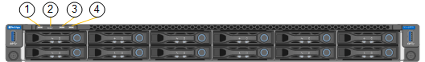

= View status indicators and codes
:icons: font
:imagesdir: ../media/

[.lead]
The appliances and controllers include indicators that help you determine the status of the appliance components.

[role="tabbed-block"]
====

.SG6000
--

The SG6000 appliance controllers include indicators that help you determine the status of the appliance controller:

* <<status_indicators_sg6000cn,Status indicators and buttons on SG6000-CN controller>>
* <<general_boot_codes_sg6000,General boot-up codes>>
* <<boot_codes_sg6000_storage_controller,Boot-up status codes for SG6000 storage controllers>>

Use this information to help xref:troubleshooting-hardware-installation.adoc[troubleshoot the storage appliance hardware installation].

[[status_indicators_sg6000cn]]
*Status indicators and buttons on SG6000-CN controller*

The SG6000-CN controller includes indicators that help you determine the status of the controller, including the following indicators and buttons.

[cols="1a,2a,3a" options="header"]
|===
|  | Display| Description
|1
|Power button
|
* Blue: The controller is powered on.
* Off: The controller is powered off.

|2
|Reset button
|_No indicator_

Use this button to perform a hard reset of the controller.

|3
|Identify button
|
* Blinking or solid blue: Identifies the controller in the cabinet or rack.
* Off: The controller is not visually identifiable in the cabinet or rack.

This button can be set to Blink, On (Solid), or Off.

|4
|Alarm LED
|* Amber: An error has occurred.
+
*Note:* To view the boot-up and error codes, you must access the BMC interface.
* Off: No errors are present.
|===

[[general_boot_codes_sg6000]]
*General boot-up codes*

During boot-up or after a hard reset of the SG6000-CN controller, the following occurs:

. The baseboard management controller (BMC) logs codes for the boot-up sequence, including any errors that occur.
. The power button lights up.
. If any errors occur during boot-up, the alarm LED lights up.
+
To view the boot-up and error codes, you must xref:accessing-bmc-interface.adoc[access the BMC interface].

[[boot_codes_sg6000_storage_controller]]
*Boot-up status codes for SG6000 storage controllers*

Each storage controller has a seven-segment display that provides status codes as the controller powers up. The status codes are the same for both the E2800 controller and the EF570 controller.

For descriptions of these codes, see the E-Series system monitoring information for you storage controller type.

.Steps

. During boot-up, monitor progress by viewing the codes shown on the seven-segment display for each storage controller.
+
The seven-segment display on each storage controller shows the repeating sequence *OS*, *Sd*, `*_blank_*` to indicate that the controller is performing start-of-day processing.

. After the controllers have booted up, confirm that each storage controller shows 99, which is the default ID for an E-Series controller shelf.
+
Make sure this value is displayed on both storage controllers, as shown in this example E2800 controller.
+
image::../media/seven_segment_display_codes_for_e2800.gif[Seven-Segment Display Codes for E2800]

. If one or both controllers show other values, see xref:troubleshooting-hardware-installation.adoc[Troubleshoot hardware installation (SG6000)] and confirm you completed the installation steps correctly. If you are unable to resolve the problem, contact technical support.

.Related information

https://mysupport.netapp.com/site/global/dashboard[NetApp Support^]

xref:powering-on-sg6000-cn-controller-and-verifying-operation.adoc[Power on SG6000-CN controller and verify operation]
--

.SG5700
--

The appliance controllers include indicators that help you determine the status of the appliance controller:

* <<boot_codes_sg5700,SG5700 boot-up status codes>>
* <<status_indicators_e5700sg_controller,Status indicators on E5700SG controller>>
* <<general_boot_codes_sg5700,General boot-up codes>>
* <<boot_codes_e5700sg_controller,E5700SG controller boot-up codes>>
* <<error_codes_e5700sg_controller,E5700SG controller error codes>>

Use this information to help xref:troubleshooting-hardware-installation.adoc[troubleshoot the storage appliance hardware installation].

[[boot_codes_sg5700]]
*SG5700 boot-up status codes*

The seven-segment displays on each controller show status and error codes as the appliance powers up.

The E2800 controller and the E5700SG controller display different statuses and error codes.

To understand what these codes mean, see the following resources:

[options="header"]
|===
| Controller| Reference
a|
E2800 controller
a|
_E5700 and E2800 System Monitoring Guide_

*Note:* The codes listed for the E-Series E5700 controller do not apply to the E5700SG controller in the appliance.

a|
E5700SG controller
a|
"`Status indicators on the E5700SG controller`"

|===

.Steps

. During boot-up, monitor progress by viewing the codes shown on the seven-segment displays.
 ** The seven-segment display on the E2800 controller shows the repeating sequence *OS*, *Sd*, `*_blank_*` to indicate that it is performing start-of-day processing.
 ** The seven-segment display on the E5700SG controller shows a sequence of codes, ending with *AA* and *FF*.
. After the controllers have booted up, confirm the seven-segment displays show the following:
+
image::../media/seven_segment_display_codes.gif[Seven-segment displays after controllers have booted up.]
+
[options="header"]
|===
| Controller| Seven-segment display
a|
E2800 controller
a|
Shows 99, which is the default ID for an E-Series controller shelf.
a|
E5700SG controller
a|
Shows *HO*, followed by a repeating sequence of two numbers.

----
HO -- IP address for Admin Network -- IP address for Grid Network HO
----

In the sequence, the first set of numbers is the DHCP-assigned IP address for the controller's management port 1. This address is used to connect the controller to the Admin Network for StorageGRID. The second set of numbers is the DHCP-assigned IP address used to connect the appliance to the Grid Network for StorageGRID.

*Note:* If an IP address could not be assigned using DHCP, 0.0.0.0 is displayed.

|===

. If the seven-segment displays show other values, see xref:troubleshooting-hardware-installation.adoc[Troubleshoot hardware installation (SG5700)] and confirm you completed the installation steps correctly. If you are unable to resolve the problem, contact technical support.

[[status_indicators_e5700sg_controller]]
*Status indicators on E5700SG controller*

The seven-segment display and the LEDs on the E5700SG controller show status and error codes while the appliance powers up and while the hardware is initializing. You can use these displays to determine status and troubleshoot errors.

After the StorageGRID Appliance Installer has started, you should periodically review the status indicators on the E5700SG controller.

image::../media/e5700sg_leds.gif[Status indicators on E5700SG controller]

[options="header"]
|===
|  | Display| Description
a|
1
a|
Attention LED
a|
Amber: The controller is faulty and requires operator attention, or the installation script was not found.

Off: The controller is operating normally.
a|
2
a|
Seven-segment display
a|
Shows a diagnostic code

Seven-segment display sequences enable you to understand errors and the operational state of the appliance.
a|
3
a|
Expansion Port Attention LEDs
a|
Amber: These LEDs are always amber (no link established) because the appliance does not use the expansion ports.
a|
4
a|
Host Port Link Status LEDs
a|
Green: The link is up.

Off: The link is down.
a|
5
a|
Ethernet Link State LEDs
a|
Green: A link is established.

Off: No link is established.
a|
6
a|
Ethernet Activity LEDs
a|
Green: The link between the management port and the device to which it is connected (such as an Ethernet switch) is up.

Off: There is no link between the controller and the connected device.

Blinking Green: There is Ethernet activity.
|===

[[general_boot_codes_sg5700]]
*General boot-up codes*

During boot-up or after a hard reset of the appliance, the following occurs:

. The seven-segment display on the E5700SG controller shows a general sequence of codes that is not specific to the controller. The general sequence ends with the codes AA and FF.
. Boot-up codes that are specific to the E5700SG controller appear.

[[boot_codes_e5700sg_controller]]
*E5700SG controller boot-up codes*

During a normal boot-up of the appliance, the seven-segment display on the E5700SG controller shows the following codes in the order listed:

[options="header"]
|===
| Code| Indicates
a|
HI
a|
The master boot script has started.
a|
PP
a|
The system is checking to see if the FPGA needs to be updated.
a|
HP
a|
The system is checking to see if the 10/25-GbE controller firmware needs to be updated.
a|
RB
a|
The system is rebooting after applying firmware updates.
a|
FP
a|
The hardware subsystem firmware update checks have been completed. Inter-controller communication services are starting.
a|
HE
a|
The system is awaiting connectivity with the E2800 controller and synchronizing with the SANtricity operating system.

*Note:* If this boot procedure does not progress past this stage, check the connections between the two controllers.

a|
HC
a|
The system is checking for existing StorageGRID installation data.
a|
HO
a|
The StorageGRID Appliance Installer is running.
a|
HA
a|
StorageGRID is running.
|===

[[error_codes_e5700sg_controller]]
*E5700SG controller error codes*

These codes represent error conditions that might be shown on the E5700SG controller as the appliance boots up. Additional two-digit hexadecimal codes are displayed if specific low-level hardware errors occur. If any of these codes persists for more than a second or two, or if you are unable to resolve the error by following one of the prescribed troubleshooting procedures, contact technical support.

[options="header"]
|===
| Code| Indicates
a|
22
a|
No master boot record found on any boot device.
a|
23
a|
The internal flash disk is not connected.
a|
2A, 2B
a|
Stuck bus, unable to read DIMM SPD data.
a|
40
a|
Invalid DIMMs.
a|
41
a|
Invalid DIMMs.
a|
42
a|
Memory test failed.
a|
51
a|
SPD reading failure.
a|
92 to 96
a|
PCI bus initialization.
a|
A0 to A3
a|
SATA drive initialization.
a|
AB
a|
Alternate boot code.
a|
AE
a|
Booting OS.
a|
EA
a|
DDR4 training failed.
a|
E8
a|
No memory installed.
a|
EU
a|
The installation script was not found.
a|
EP
a|
Installation or communication with the E2800 controller has failed.

.Related information

https://mysupport.netapp.com/site/global/dashboard[NetApp Support^]

https://library.netapp.com/ecmdocs/ECMLP2588751/html/frameset.html[E5700 and E2800 System Monitoring Guide^]

|===
--

.SG5600
--

The appliance controllers include indicators that help you determine the status of the appliance controller:

* <<boot_error_codes_sg5600_controller,Boot-up status and error codes on SG5600 controllers>>
* <<seven_segment_codes_e5600sg,E5600SG controller seven-segment display codes>>
* <<general_boot_codes_sg5600,General boot-up codes>>
* <<normal_boot_codes_sg5600,Normal boot-up codes>>
* <<error_codes_e5600sg_controller,E5600SG controller error codes>>

Use this information to help xref:troubleshooting-hardware-installation.adoc[troubleshoot the storage appliance hardware installation].

[[boot_error_codes_sg5600_controller]]
*Boot-up status and error codes on SG5600 controllers*

The seven-segment display on each controller shows status and error codes when the appliance powers up, while the hardware is initializing, and when the hardware fails and must back out of the initialization. If you are monitoring the progress or troubleshooting, you should watch the sequence of the codes as they appear.

The status and error codes for the E5600SG controller are not the same as those for the E2700 controller.

.Steps

. During boot-up, view the codes shown on the seven-segment displays to monitor progress.
. To review error codes for the E5600SG controller, see the seven-segment display status and error code information.
. To review error codes for the E2700 controller, see the E2700 controller documentation on the Support Site.

[[seven_segment_codes_e5600sg]]
*E5600SG controller seven-segment display codes*

The seven-segment display on the E5600SG controller shows status and error codes while the appliance powers up and while the hardware is initializing. You can use these codes to determine status and troubleshoot errors.

When reviewing status and error codes on the E5600SG controller, you should look at the following types of codes:

* *General boot-up codes*
+
Represent the standard boot-up events.

* *Normal boot-up codes*
+
Represent the normal boot-up events that occur in the appliance.

* *Error codes*
+
Indicate issues during the boot-up events.

StorageGRID controls only the following LEDs on the E5600SG controller and only after the StorageGRID Appliance Installer has started:

* Service Action Allowed LED
* Service Action Required LED
* Seven-segment display

image::../media/appliance_e5600_leds.gif[LEDs and seven-segment display on E5600SG controller]

The decimal points on the seven-segment display are not used by the StorageGRID appliance:

* The upper decimal point adjacent to the least significant digit is the platform diagnostic LED.
+
This is turned on during reset and initial hardware configuration. Otherwise, it is turned off.

* The lower decimal point adjacent to the most significant digit is turned off.

To diagnose other issues, you might want to look at these resources:

* To see all other hardware and environmental diagnostic information, see the E-Series operating system hardware diagnostics.
+
This includes looking for hardware issues such as power, temperature, and disk drives. The appliance relies on the E-Series operating system to monitor all platform environmental statuses.

* To determine firmware and driver issues, look at the link lights on the SAS and network ports.
+
For details, see the E-Series E5600 documentation.

[[general_boot_codes_sg5600]]
*General boot-up codes*

During boot-up or after a hard reset of the hardware, the Service Action Allowed and the Service Action Required LEDs come on while the hardware is initializing. The seven-segment display shows a sequence of codes that are the same for E-Series hardware and not specific to the E5600SG controller.

During boot-up, the Field Programmable Gate Array (FPGA) controls the functions and initialization on the hardware.

[options="header"]
|===
| Code| Indication
a|
19
a|
FPGA initialization.
a|
68
a|
FPGA initialization.
a|
...
a|
FPGA initialization.This is a quick succession of codes.

a|
AA
a|
Platform BIOS booting.
a|
FF
a|
Bios boot-up complete.This is an intermediate state before E5600SG controller initializes and manages LEDs to indicate status.

|===
After the AA and FF codes appear, either the normal boot-up codes appear or error codes appear. Additionally, the Service Action Allowed and the Service Action Required LEDs are turned off.

[[normal_boot_codes_sg5600]]
*Normal boot-up codes*

These codes represent the normal boot-up events that occur in the appliance, in chronological order.

[options="header"]
|===
| Code| Indication
a|
HI
a|
The master boot script has started.
a|
PP
a|
The platform FPGA firmware is checking for updates.
a|
HP
a|
The host interface card (HIC) is checking for updates.
a|
RB
a|
After firmware updates, the system is rebooting, if necessary.
a|
FP
a|
The firmware update checks have been completed. Starting the process (utmagent) to communicate with and manage the E2700 controller. This process facilitates appliance provisioning.
a|
HE
a|
The system is synchronizing with the E-Series operating system.
a|
HC
a|
The StorageGRID installation is being checked.
a|
HO
a|
Installation management and active interfacing are occurring.
a|
HA
a|
The Linux operating system and StorageGRID are running.
|===

[[error_codes_e5600sg_controller]]
*E5600SG controller error codes*

These codes represent error conditions that might be shown on the E5600SG controller as the appliance boots up. Additional two-digit hexadecimal codes are displayed if specific low-level hardware errors occur. If any of these codes persists for more than a second or two, or if you are unable to resolve the error by following one of the prescribed troubleshooting procedures, contact technical support.

[options="header"]
|===
| Code| Indication
a|
22
a|
No master boot record found on any boot device.
a|
23
a|
No SATA drive installed.
a|
2A, 2B
a|
Stuck bus, unable to read DIMM SPD data.
a|
40
a|
Invalid DIMMs.
a|
41
a|
Invalid DIMMs.
a|
42
a|
Memory test failed.
a|
51
a|
SPD reading failure.
a|
92 to 96
a|
PCI bus initialization.
a|
A0 to A3
a|
SATA drive initialization.
a|
AB
a|
Alternate boot code.
a|
AE
a|
Booting OS.
a|
EA
a|
DDR3 training failed.
a|
E8
a|
No memory installed.
a|
EU
a|
The installation script was not found.
a|
EP
a|
"ManageSGA" code indicates that pregrid communication with the E2700 controller failed.

.Related information

https://mysupport.netapp.com/site/global/dashboard[NetApp Support^]

http://mysupport.netapp.com/documentation/productlibrary/index.html?productID=61765[NetApp Documentation: E2700 Series^]

|===
--

.SG100 and SG1000
--

The appliance includes indicators that help you determine the status of the appliance controller and the two SSDs:

* <<appliance_indicators_SG100_1000,Appliance indicators and buttons>>
* <<general_boot_codes_SG100_1000,General boot-up codes>>
* <<ssd_indicators_SG100_1000,SSD indicators>>

Use this information to help xref:troubleshooting-hardware-installation-sg100-and-sg1000.adoc[troubleshoot the SG100 and SG1000 hardware installation].

[[appliance_indicators_SG100_1000]]
*Appliance indicators and buttons*

[options="header"]
|===
|  | Display| State
a|
1
a|
Power button
a|

* Blue: the appliance is powered on.
* Off: the appliance is powered off.

a|
2
a|
Reset button
a|
Use this button to perform a hard reset of the controller.
a|
3
a|
Identify button
a|
This button can be set to Blink, On (Solid), or Off.

* Blue, blinking: Identifies the appliance in the cabinet or rack.
* Blue, solid: Identifies the appliance in the cabinet or rack.
* Off: The appliance is not visually identifiable in the cabinet or rack.

a|
4
a|
Alarm LED
a|

* Amber, solid: An error has occurred.
+
*Note:* To view the boot-up and error codes, you must access the BMC interface.

* Off: No errors are present.

|===

[[general_boot_codes_SG100_1000]]
*General boot-up codes*

During boot-up or after a hard reset of the appliance, the following occurs:

. The baseboard management controller (BMC) logs codes for the boot-up sequence, including any errors that occur.
. The power button lights up.
. If any errors occur during boot-up, the alarm LED lights up.
+
To view the boot-up and error codes, you must xref:accessing-bmc-interface.adoc[access the BMC interface].

[[ssd_indicators_SG100_1000]]
*SSD indicators*

image::../media/ssd_indicators.png[SSD Indicators]

[options="header"]
|===
| LED| Display| State
a|
1
a|
Drive status/fault
a|

* Blue (solid): drive is online
* Amber (blinking): drive failure
* Off: slot is empty

a|
2
a|
Drive active
a|
Blue (blinking): drive is being accessed
|===
--
====

