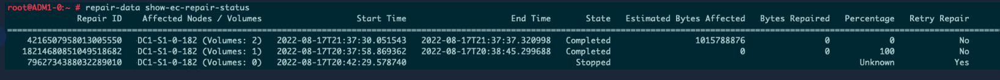

= Check data repair jobs
:icons: font
:imagesdir: ../media/

[.lead]
Before decommissioning a grid node, you must confirm that no data repair jobs are active. If any repairs have failed, you must restart them and allow them to complete before performing the decommission procedure.

If you need to decommission a disconnected Storage Node, you will also complete these steps after the decommission procedure completes in order to ensure the data repair job has completed successfully. You must ensure that any erasure-coded fragments that were on the removed node have been restored successfully.

These steps only apply to systems that have erasure-coded objects.

. Log in to the primary Admin Node:
 .. Enter the following command: `ssh admin@_grid_node_IP_`
+
When you are logged in as root, the prompt changes from `$` to `#`.

 .. Enter the password listed in the `Passwords.txt` file.
 .. Enter the following command to switch to root: `su -`
 .. Enter the password listed in the `Passwords.txt` file.
. Check for running repairs: `repair-data show-ec-repair-status`
 ** If you have never run a data repair job, the output is `No job found`. You do not need to restart any repair jobs.
 ** If the data repair job was run previously or is running currently, the output lists information for the repair. Each repair has a unique repair ID. Go to the next step.
 ** You can also monitor the status of restoration jobs in process and view a history of restoration jobs completed in 
link:../maintain/restoring-volume.html[Grid Manager].

+

. If the State for all repairs is `Completed`, you do not need to restart any repair jobs.
. If the State for any repair is `Stopped`, you must restart that repair.
 .. Obtain the repair ID for the failed repair from the output.
 .. Run the `repair-data start-ec-node-repair` command.
+
Use the `--repair-id` option to specify the Repair ID. For example, if you want to retry a repair with repair ID 949292, run this command: `repair-data start-ec-node-repair --repair-id 949292`

 .. Continue to track the status of EC data repairs until the State for all repairs is `Completed`.
