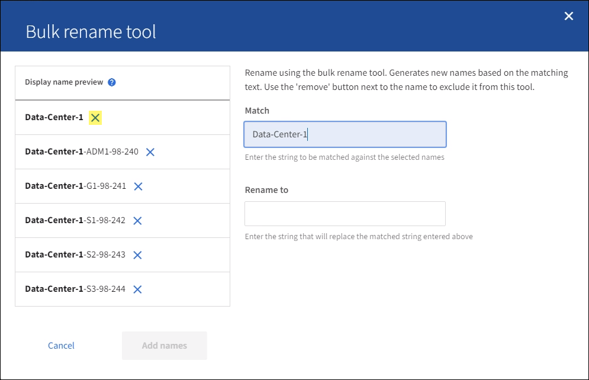
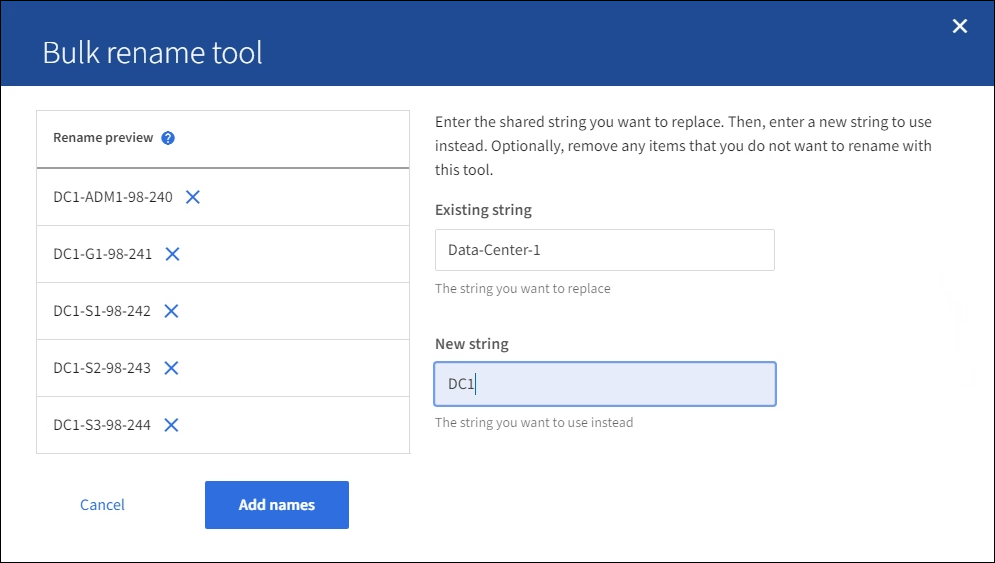

= Rename a grid, site, or node
:icons: font
:imagesdir: ../media/

[.lead]
As required, you can change the display names that are shown throughout the Grid Manager for the entire grid, each site, and each node. You can update display names safely and whenever you need. 

You can use this procedure to rename a single item, multiple items, or even all items at once. Changing a display name does not affect StorageGRID operations in any way. 

== What the rename procedure does

When you install StorageGRID initially, you specify a grid name, site names, and node names. These initial names serve as both internal _system names_ and as _display names_. 

System names are required for StorageGRID operations and cannot be changed. In contrast, display names (the names shown throughout the Grid Manager) can be updated whenever required. 

For example, you might want to change display names to fix typos, to implement different node-naming conventions, or to indicate that a site and all of its nodes have been relocated. You can use this procedure whenever you want and as many times as you want. 

== Display name requirements and best practices

Display names must be unique across your StorageGRID system.

== How to rename your grid, sites, and nodes

.What you'll need

* You are signed in to the Grid Manager using a xref:../admin/web-browser-requirements.adoc[supported web browser].
* You have the Maintenance or Root access permission.
* You have the provisioning passphrase.

=== Select items to rename

. Select *MAINTENANCE* > *Task* > *Rename*.
. Select the items you want to rename.
+
* To change the names of everything (or almost everything) in your system, select *Select all*. Then, optionally unselect any items you do not want to rename. 
* To change the name of your grid, select the check box for the grid. 
* To change the name of a site, select the check box for that site. 
* To change the name of a node, select the check box for that node.

. Select *Continue*.

. Review the table, which includes the items you selected.
+
* The *Display name* column shows the current display name for each item. You will provide new display names in this column.
* The *System name* column shows the name you entered for each item during installation. System names are used for internal StorageGRID operations and cannot be changed. For example, the system name for a node might be its hostname.
* The *Type* column indicates the item's type: Grid, Site, or the specific type of node.

=== Propose new display names

You can enter a new display name for each item individually, or you can rename items in bulk. Use the bulk rename tool if item names share a common string that you want to replace with a different string. 

// start tabbed area

[role="tabbed-block"]
====

.Rename items individually
--
. Enter a new display name for each item in the table.
+
Display names must be unique across your StorageGRID system.

. Optionally, select &#215; in the *Remove* column to remove any items you do not want to rename.
. When you are ready to rename all of the items in the table, select *Rename*.
+
A success message is shown. The new display names are now used throughout Grid Manager.

--
.Rename items in bulk
--
. Select *Use bulk rename tool*.
+
The list includes all items that were shown in the Proposed names step.

. In the *Match* field, enter the shared string you want to replace. For example, if the string you want to replace is "`Data Center 1,`" enter *Data Center 1*.
+
As you type, your text is highlighted wherever it is found in the names on the left.

. Optionally, select &#215; to remove any items that you do not want to rename with this tool. 
+
For example, suppose you want to rename all nodes that contain the string "`Data Center 1,`" but you do not want to rename Data Center 1 itself.  Select &#215; to remove the site from the list.
+

. In the *Rename to* field, enter the replacement string you want to use instead.
+
For example, enter *DC1*.
+
As you enter the replacement string, the names on the left are updated, so you can verify that the new names will be correct.
+ 

. When you are satisfied with the new proposed names, select *Add names* to add the names to the Propose new names table. 

. Make any additional changes required.

. When you are ready to rename all items in the table, select *Rename*.
+
A success message is shown. The new display names are now used throughout Grid Manager.

--
====

// end tabbed area

=== Download the recovery package

. Enter the provisioning passphrase and select *Download recovery package*.
+
The download starts immediately.

. When the download completes:

.. Open the `.zip` file.

.. Confirm it includes a gpt-backup directory and an inner `.zip` file.

.. Extract the inner `.zip` file.

.. Confirm you can open the `Passwords.txt` file.

. Copy the downloaded Recovery Package file (`.zip`) to two safe, secure, and separate locations.
+
IMPORTANT:	The Recovery Package file must be secured because it contains encryption keys and passwords that can be used to obtain data from the StorageGRID system.

