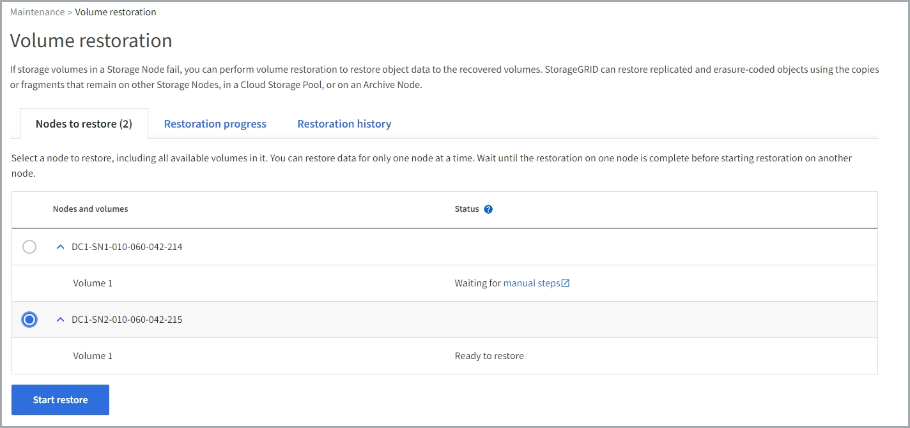
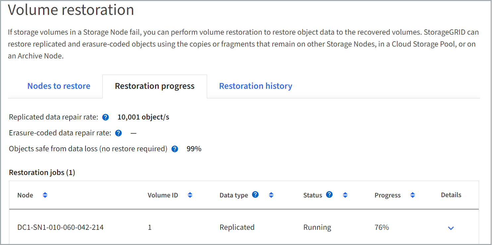
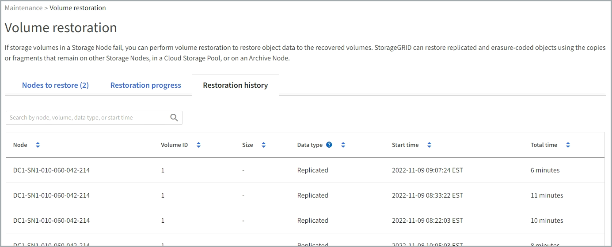

= Restore object data using Grid Manager
:icons: font
:imagesdir: ../media/

[.lead]
You can restore object data for a failed storage volume or Storage Node using Grid Manager. You can also use Grid Manager to monitor restoration processes in progress and display a restoration history.

.What you'll need

* You have completed either of these procedures to format failed volumes:

** link:../maintain/remounting-and-reformatting-appliance-storage-volumes.html[Remount and reformat appliance storage volumes (manual steps)] 
** link:../maintain/emounting-and-reformatting-storage-volumes-manual-steps.html[Remount and reformat storage volumes (manual steps)]

* You have confirmed that the Storage Node where you are restoring objects has a Connection State of *Connected* image:../media/icon_alert_green_checkmark.png[icon alert green checkmark] on the *NODES* > *Overview* tab in the Grid Manager.

* You have confirmed the following:
** A grid expansion to add a Storage Node is not in process.
** A Storage Node decommission is not in process or failed.
** A recovery of a failed storage volume is not in process.
** A recovery of a Storage Node with a failed system drive is not in process.
** An EC rebalance job is not in process.
** Appliance node cloning is not in process.

.About this task

After drives are replaced and manual steps to format the volumes are performed, Grid Manger displays the volumes as candidates for restoration on the *MAINTENANCE* > *Volume restoration* > *Nodes to restore* tab.

Use Grid Manager to restore storage volumes and nodes:

* If some, but not all, storage volumes in a node have failed
* If all storage volumes in a node have failed and are being replaced with same number of volumes or more volumes

Use the `repair-data` script to restore storage volumes and nodes if all storage volumes in a node have failed and are being replaced with fewer storage volumes than before.

You can also use Grid Manager to <<view-restoration-progress,monitor the volume restoration process>> and <<view-restoration-history,view restoration history>>. If necessary, you can link:../maintain/restoring-object-data-to-storage-volume-for-appliance.html[use the repair-data script to restore volumes and nodes].

Two types of data objects can be restored:

* Erasure coded (EC) data objects are restored by reassembling the stored fragments. Corrupt or lost fragments are recreated by the erasure-coding algorithm from the remaining data and parity fragments.
* Replicated data objects are restored from other locations, assuming that the grid's ILM rules were configured to make object copies available. 
** If an ILM rule was configured to store only one replicated copy and that copy existed on a storage volume that failed, you will not be able to recover the object.
** If the only remaining copy of an object is in a Cloud Storage Pool, StorageGRID must issue multiple requests to the Cloud Storage Pool endpoint to restore object data. 
** If the only remaining copy of an object is on an Archive Node, object data is retrieved from the Archive Node. Restoring object data to a Storage Node from an Archive Node takes longer than restoring object copies from other Storage Nodes.

NOTE: Volume restoration is dependent on the availability of resources where object copies are stored. Progress of volume restoration is nonlinear and might take days or weeks to complete.

== Restore failed volume or node

Follow these steps to restore a failed volume or node.

.Steps

. In Grid Manager go to *MAINTENANCE* > *Volume restoration*.

. Select the *Nodes to restore* tab.
+
The number on the tab indicates the number of nodes with volumes requiring restoration.
+

. Expand each node to see the volumes in it that need restoration and their status.
 
. Correct any issues preventing restoration of each volume that are indicated when you select Waiting for manual steps, if it displays as the volume status.

. Select a node to restore where all the volumes indicate a Ready to restore status.
+
You can only restore the volumes for one node at a time.
+
Each volume in the node must indicate that it is ready to restore.

. Select *Start restore*.

. Address any warnings that might appear or select *Start anyway* to ignore the warnings and start the restoration.

Nodes are moved from the *Nodes to restore* tab to the *Restoration progress* tab when the restoration starts.

If a volume restoration can't be started, the node returns to the *Nodes to restore* tab.

== [[view-restoration-progress]]View restoration progress

The *Restoration progress* tab shows the status of the volume restoration process and information about the volumes for a node being restored.

Data repair rates for replicated and erasure-coded objects in all volumes are estimates summarizing all restorations in process, including those restorations initiated using the `repair-data` script. The percentage of objects in those volumes that are intact and do not require restoration is also indicated.

NOTE: Replicated data restoration is dependent on the availability of resources where the replicated copies are stored. Progress of replicated data restoration is nonlinear and might take days or weeks to complete.

The Restoration jobs section displays information about volume restorations started from Grid Manager.

* The number in the Restoration jobs section heading indicates the number of volumes that are either being restored or queued for restoration.

* The table displays information about each volume in a node being restored and its progress.

** The progress for each node displays the percentage for each job.
** Expand the Details column to display the restoration start time and job ID.

* If a volume restoration fails:
** The Status column indicates failed.
** An error appears, indicating the cause of failure.
+
Correct the issues indicated in the error. Then select *Retry* to re-initiate the volume restoration. 
+
If multiple restoration jobs have failed, selecting *Retry* starts the most recently failed job.

== [[view-restoration-history]]View restoration history

The *Restoration history* tab shows information about all volume restorations that have successfully completed.

NOTE: Sizes are not applicable for replicated objects and display only for restorations that contain erasure coded (EC) data objects.

