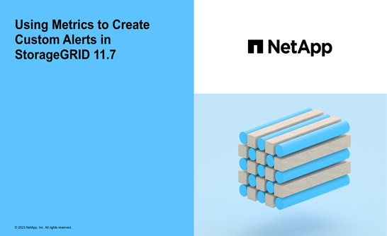

= Manage alerts: overview
:icons: font
:imagesdir: ../media/

[.lead]
The alert system provides an easy-to-use interface for detecting, evaluating, and resolving the issues that can occur during StorageGRID operation.

You can create custom alerts, edit or disable alerts, and manage alert notifications.

To learn more:

* Review the video: https://netapp.hosted.panopto.com/Panopto/Pages/Viewer.aspx?id=18df5a3d-bf19-4a9e-8922-afbd009b141b[Video: Alerts overview for StorageGRID 11.7^]
+
image::../media/video-screenshot-alert-overview-117.png[link="https://netapp.hosted.panopto.com/Panopto/Pages/Viewer.aspx?id=18df5a3d-bf19-4a9e-8922-afbd009b141b" alt="Video: Alerts overview for StorageGRID 11.7", window=_blank]

* Review the video: https://netapp.hosted.panopto.com/Panopto/Pages/Viewer.aspx?id=61acb7ba-7683-488a-a689-afb7010088f3[Video: Using metrics to create custom alerts in StorageGRID 11.7^]
+

* See the link:alerts-reference.html[Alerts reference].