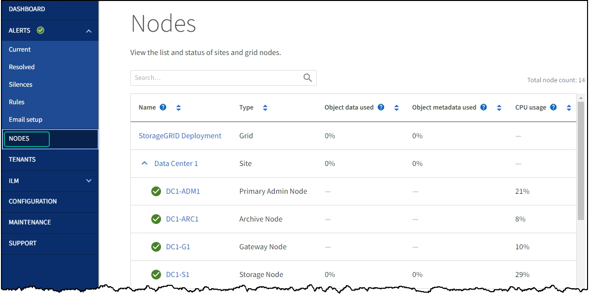
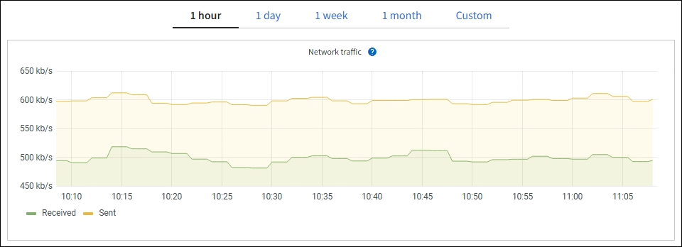

= Monitor networking and system resources
:icons: font
:imagesdir: ../media/

[.lead]
The integrity and bandwidth of the network between nodes and sites, and the resource usage by individual grid nodes, are critical to efficient operations.

== Monitor network connections and performance

Network connectivity and bandwidth are especially important if your information lifecycle management (ILM) policy copies replicated objects between sites or stores erasure-coded objects using a scheme that provides site-loss protection. If the network between sites is not available, network latency is too high, or network bandwidth is insufficient, some ILM rules might not be able to place objects where expected. This can lead to ingest failures (when the Strict ingest option is selected for ILM rules), or to poor ingest performance and ILM backlogs.

Use the Grid Manager to monitor connectivity and network performance, so you can address any issues promptly.

Additionally, consider link:../admin/managing-traffic-classification-policies.html[creating network traffic classification policies] so that you can monitor traffic related to specific tenants, buckets, subnets, or load balancer endpoints. You can set traffic limiting policies as needed.

.Steps
. Select *NODES*.
+
The Nodes page appears. Each node in the grid is listed in table format.
+

+
. Select the grid name, a specific data center site, or a grid node, and then select the *Network* tab.
+
The Network Traffic graph provides a summary of overall network traffic for the grid as a whole, the data center site, or for the node.
+

 .. If you selected a grid node, scroll down to review the *Network Interfaces* section of the page.
+
image::../media/nodes_page_network_interfaces.png[Nodes Page Network Interfaces]

 .. For grid nodes, scroll down to review the *Network Communication* section of the page.
+
The Receive and Transmit tables show how many bytes and packets have been received and sent across each network as well as other receive and transmission metrics.
+
image::../media/nodes_page_network_communication.png[Nodes Page Network Comm]

. Use the metrics associated with your traffic classification policies to monitor network traffic.
 .. Select *CONFIGURATION* > *Network* > *Traffic classification*.
+
The Traffic Classification Policies page appears, and the existing policies are listed in the table.
+
image::../media/traffic_classification_policies_main_screen_w_examples.png[Traffic Policy for Graph Example]

 .. To view graphs that show the networking metrics associated with a policy, select the radio button to the left of the policy, and then click *Metrics*.
 .. Review the graphs to understand the network traffic associated with the policy.
+
If a traffic classification policy is designed to limit network traffic, analyze how often traffic is limited and decide if the policy continues to meet your needs. From time to time, link:../admin/managing-traffic-classification-policies.html[adjust each traffic classification policy as needed].

.Related information

link:viewing-network-tab.html[View the Network tab]

link:monitoring-system-health.html#monitor-node-connection-states[Monitor node connection states]

== Monitor node-level resources

Monitor individual grid nodes to check their resource usage levels. If nodes are consistently overloaded, more nodes might be required for efficient operations.

.Steps
. From the *NODES* page, select the node.
. Select the *Hardware* tab to display graphs of CPU Utilization and Memory Usage.
+
image::../media/nodes_page_hardware_tab_graphs.png[Nodes page Hardware tab]

. To display a different time interval, select one of the controls above the chart or graph. You can display the information available for intervals of 1 hour, 1 day, 1 week, or 1 month. You can also set a custom interval, which allows you to specify date and time ranges.
. If the node is hosted on a storage appliance or a services appliance, scroll down to view the tables of components. The status of all components should be "`Nominal.`" Investigate components that have any other status.

.Related information

link:viewing-hardware-tab.html#view-information-about-appliance-storage-nodes[View information about appliance Storage Nodes]

link:viewing-hardware-tab.html#view-information-about-appliance-admin-nodes-and-gateway-nodes[View information about appliance Admin Nodes and Gateway Nodes]