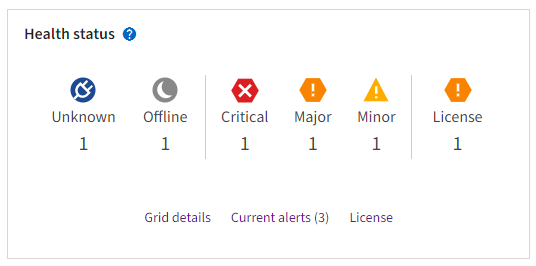

= Monitor system health
:icons: font
:imagesdir: ../media/

[.lead]
Monitor the overall health of your StorageGRID system on a daily basis.

.About this task

The StorageGRID system can continue to operate when parts of the grid are unavailable. Potential issues indicated by alerts or alarms (legacy system) are not necessarily issues with system operations. Investigate issues summarized on the Health status card of the Grid Manager Dashboard.

To be notified of alerts as soon as they are triggered, you can link:../installconfig/setting-up-email-notifications-for-alerts.html[set up email notifications for alerts] or link:using-snmp-monitoring.html[configure SNMP traps].

When issues exist, links appear that allow you to view additional details:

[cols="1a,2a" options="header"]
|===
| Link| Appears when...
|Grid details
|Any nodes are disconnected (connection state Unknown or Administratively Down).

|Current alerts (Critical, Major, Minor)
|Alerts are <<View current and resolved alerts,currently active>>.

|Recently resolved alerts
|Alerts triggered in the past week <<View current and resolved alerts,are now resolved>>.

|License
|There is an issue with the software license for this StorageGRID system. You can link:../admin/updating-storagegrid-license-information.html[update license information as needed].
|===

[#monitor-node-connection-states]
== Monitor node connection states

If one or more nodes are disconnected from the grid, critical StorageGRID operations might be affected. Monitor node connection states and address any issues promptly.

[cols="1a,3a,3a" options="header"]
|===
| Icon| Description| Action required

|image:../media/icon_alarm_blue_unknown.png[blue question mark icon]
|*Not connected - Unknown*

For an unknown reason, a node is disconnected or services on the node are unexpectedly down. For example, a service on the node might be stopped, or the node might have lost its network connection because of a power failure or unexpected outage.

The *Unable to communicate with node* alert might also be triggered. Other alerts might also be active.

|Requires immediate attention. <<View current and resolved alerts,Select each alert>> and follow the recommended actions.

For example, you might need to restart a service that has stopped or restart the host for the node.

*Note*: A node might appear as Unknown during managed shutdown operations. You can ignore the Unknown state in these cases.

|image:../media/icon_alarm_gray_administratively_down.png[gray questionmark icon]
|*Not connected - Administratively down*

For an expected reason, node is not connected to grid.

For example, the node, or services on the node, has been gracefully shut down, the node is rebooting, or the software is being upgraded. One or more alerts might also be active.

Based on the underlying issue, these nodes often go back online with no intervention.
|
Determine if any alerts are affecting this node.

If one or more alerts are active, <<View current and resolved alerts,select each alert>> and follow the recommended actions.

|image:../media/icon_alert_green_checkmark.png[icon alert green checkmark]
|*Connected*

The node is connected to the grid.
|No action required.
|===

== View current and resolved alerts

*Current alerts*: When an alert is triggered, an alert icon is displayed on the dashboard. An alert icon is also displayed for the node on the Nodes page. If link:email-alert-notifications.html[alert email notifications are configured], an email notification will also be sent, unless the alert has been silenced.

*Resolved alerts*: You can search and view a history of alerts that have been resolved.

Watch this https://netapp.hosted.panopto.com/Panopto/Pages/Viewer.aspx?id=2680a74f-070c-41c2-bcd3-acc5013c9cdd[video for an overview of alerts^].

image::../media/video-screenshot-alert-overview.png[link="https://netapp.hosted.panopto.com/Panopto/Pages/Viewer.aspx?id=2680a74f-070c-41c2-bcd3-acc5013c9cdd" alt="Video: Overview of Alerts", window=_blank]

The following table describes the information shown in the Grid Manager for current and resolved alerts.

[cols="1a,3a" options="header"]
|===
| Column header| Description
|Name or title
|The name of the alert and its description.

|Severity
|The severity of the alert. For current alerts, if multiple alerts are grouped the title row shows how many instances of that alert are occurring at each severity.

image:../media/icon_alert_red_critical.png[Icon Alert Red Critical] *Critical*: An abnormal condition exists that has stopped the normal operations of a StorageGRID node or service. You must address the underlying issue immediately. Service disruption and loss of data might result if the issue is not resolved.

image:../media/icon_alert_orange_major.png[Icon Alert Orange Major] *Major*: An abnormal condition exists that is either affecting current operations or approaching the threshold for a critical alert. You should investigate major alerts and address any underlying issues to ensure that the abnormal condition does not stop the normal operation of a StorageGRID node or service.

image:../media/icon_alert_yellow_minor.png[Icon Alert Yellow Minor] *Minor*: The system is operating normally, but an abnormal condition exists that could affect the system's ability to operate if it continues. You should monitor and resolve minor alerts that do not clear on their own to ensure they do not result in a more serious problem.

|Time triggered
|
*Current alerts*: The date and time the alert was triggered in your local time and in UTC. If multiple alerts are grouped, the title row shows times for the most recent instance of the alert (_newest_) and the oldest instance of the alert (_oldest_).

*Resolved alerts*: How long ago the alert was triggered.

|Site/Node
|The name of the site and node where the alert is occurring or has occurred.

|Status
|Whether the alert is active, silenced, or resolved. If multiple alerts are grouped and *All alerts* is selected in the drop-down, the title row shows how many instances of that alert are active and how many instances have been silenced.

|Time resolved (resolved alerts only)
|How long ago the alert was resolved.

|Current values or _data values_
|The value of the metric that caused the alert to be triggered. For some alerts, additional values are shown to help you understand and investigate the alert. For example, the values shown for a *Low object data storage* alert include the percentage of disk space used, the total amount of disk space, and the amount of disk space used.

*Note:* If multiple current alerts are grouped, current values are not shown in the title row.

|Triggered values (resolved alerts only)
|The value of the metric that caused the alert to be triggered. For some alerts, additional values are shown to help you understand and investigate the alert. For example, the values shown for a *Low object data storage* alert include the percentage of disk space used, the total amount of disk space, and the amount of disk space used.
|===

.Steps

. Select the *Current alerts* or *Resolved alerts* link to view a list of alerts in those categories. You can also view the details for an alert by selecting *Nodes* > *_node_* > *Overview* and then selecting the alert from the Alerts table.
+
By default, current alerts are shown as follows:

* The most recently triggered alerts are shown first.
* Multiple alerts of the same type are shown as a group.
* Alerts that have been silenced are not shown.
* For a specific alert on a specific node, if the thresholds are reached for more than one severity, only the most severe alert is shown. That is, if alert thresholds are reached for the minor, major, and critical severities, only the critical alert is shown.
+
The Current alerts page is refreshed every two minutes.

. To expand groups of alerts, select the down caret image:../media/icon_alert_caret_down.png[down caret icon]. To collapse individual alerts in a group, select the up caret image:../media/icon_alert_caret_up.png[Up caret icon], or select the group's name.

. To display individual alerts instead of groups of alerts, unselect the *Group alerts* check box.

. To sort current alerts or alert groups, select the up/down arrows image:../media/icon_alert_sort_column.png[Sort arrows icon] in each column header.
 ** When *Group alerts* is selected, both the alert groups and the individual alerts within each group are sorted. For example, you might want to sort the alerts in a group by *Time triggered* to find the most recent instance of a specific alert.
 ** When *Group alerts* is unselected, the entire list of alerts is sorted. For example, you might want to sort all alerts by *Node/Site* to see all alerts affecting a specific node.

. To filter current alerts by status (*All alerts*, *Active*, or *Silenced*, use the drop-down menu at the top of the table.
+
See link:silencing-alert-notifications.html[Silence alert notifications].

. To sort resolved alerts:
 ** Select a time period from the *When triggered* drop-down menu.
 ** Select one or more severities from the *Severity* drop-down menu.
 ** Select one or more default or custom alert rules from the *Alert rule* drop-down menu to filter on resolved alerts related to a specific alert rule.
 ** Select one or more nodes from the *Node* drop-down menu to filter on resolved alerts related to a specific node.

. To view details for a specific alert, select the alert. A dialog box provides details and recommended actions for the alert you selected.

. (Optional) For a specific alert, select silence this alert to silence the alert rule that caused this alert to be triggered.
+
You must have the Manage Alerts or Root access permission to silence an alert rule.
+
IMPORTANT: Be careful when deciding to silence an alert rule. If an alert rule is silenced, you might not detect an underlying problem until it prevents a critical operation from completing.

. To view the current conditions for the alert rule:
 .. From the alert details, select *View conditions*.
+
A pop-up appears, listing the Prometheus expression for each defined severity.
 .. To close the pop-up, click anywhere outside of the pop-up.

. Optionally, select *Edit rule* to edit the alert rule that caused this alert to be triggered.
+
You must have the Manage Alerts or Root access permission to edit an alert rule.
+
IMPORTANT: Be careful when deciding to edit an alert rule. If you change trigger values, you might not detect an underlying problem until it prevents a critical operation from completing.

. To close the alert details, select *Close*.