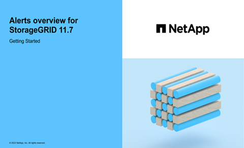

= View alert rules
:icons: font
:imagesdir: ../media/

[.lead]
Alert rules define the conditions that trigger link:alerts-reference.html[specific alerts]. StorageGRID includes a set of default alert rules, which you can use as is or modify, or you can create custom alert rules.

You can view the list of all default and custom alert rules to learn which conditions will trigger each alert and to see whether any alerts are disabled.

.Before you begin
* You are signed in to the Grid Manager using a link:../admin/web-browser-requirements.html[supported web browser].
* You have the Manage alerts or Root access permission.

* Optionally, you have watched the video: https://netapp.hosted.panopto.com/Panopto/Pages/Viewer.aspx?id=18df5a3d-bf19-4a9e-8922-afbd009b141b[Video: Alerts overview for StorageGRID 11.7^]
+

.Steps
. Select *ALERTS* > *Rules*.
+
The Alert Rules page appears.
+
image::../media/alert_rules_page.png[Alert Rules Page]

. Review the information in the alert rules table:
+
[cols="1a,3a" options="header"]
|===
| Column header| Description
a|
Name
a|
The unique name and description of the alert rule. Custom alert rules are listed first, followed by default alert rules. The alert rule name is the subject for email notifications.
a|
Conditions
a|
The Prometheus expressions that determine when this alert is triggered. An alert can be triggered at one or more of the following severity levels, but a condition for each severity is not required.

 ** *Critical* image:../media/icon_alert_red_critical.png[Icon Alert Red Critical]: An abnormal condition exists that has stopped the normal operations of a StorageGRID node or service. You must address the underlying issue immediately. Service disruption and loss of data might result if the issue is not resolved.
 ** *Major* image:../media/icon_alert_orange_major.png[Icon Alert Orange Major]: An abnormal condition exists that is either affecting current operations or approaching the threshold for a critical alert. You should investigate major alerts and address any underlying issues to ensure that the abnormal condition does not stop the normal operation of a StorageGRID node or service.
 ** *Minor* image:../media/icon_alert_yellow_minor.png[Icon Alert Yellow Minor]: The system is operating normally, but an abnormal condition exists that could affect the system's ability to operate if it continues. You should monitor and resolve minor alerts that don't clear on their own to ensure they don't result in a more serious problem.

a|
Type
a|
The type of alert rule:

 ** *Default*: An alert rule provided with the system. You can disable a default alert rule or edit the conditions and duration for a default alert rule. You can't remove a default alert rule.
 ** *Default**: A default alert rule that includes an edited condition or duration. As required, you can easily revert a modified condition back to the original default.
 ** *Custom*: An alert rule that you created. You can disable, edit, and remove custom alert rules.

a|
Status
a|
Whether this alert rule is currently enabled or disabled. The conditions for disabled alert rules aren't evaluated, so no alerts are triggered.
|===