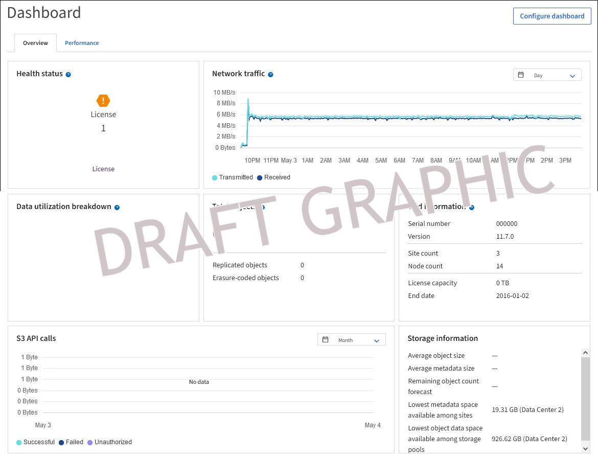
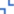
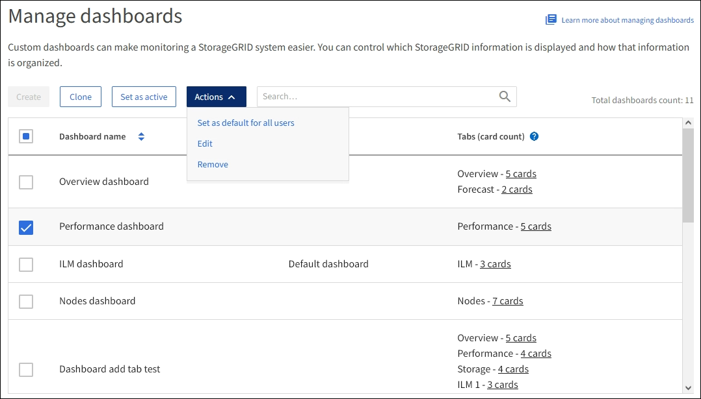

= View and configure the dashboard
:icons: font
:imagesdir: ../media/

[.lead]
You can use the dashboard to monitor system activities at a glance. The dashboard includes information about system health, usage metrics, and operational trends.

== View the dashboard

The dashboard consists of tabs that contain specific information about the StorageGRID system. Each tab contains categories of information displayed on cards. 

The default dashboard tabs contain cards with the following types of information:

[cols="1a,3a" options="header"]
|===
| Default tab| Contains

|Overview
|General information about the grid, such as active alerts, network traffic, and total objects in the grid

|Performance
|Space usage, storage used over time, S3 operations, request duration, error rate.

|Storage
|Tenant quota usage and logical space usage.

|ILM
|Information lifecycle management queue and evaluation rate.

|Nodes
|CPU, data, and memory usage by node. S3 operations by node, node to site distribution.
|===

Some of the cards can be maximized for easier viewing. Select the maximize icon  in the upper right corner of the card. To close a maximized card, select the minimize icon  or select *Close*.

== Configure the dashboard

If you have the xref:../admin/admin-group-permissions.html[required permission and access mode], you can perform the following configuration tasks for the dashboard:

* Clone the stock dashboard or another dashboard to create  custom dashboards. Custom dashboards can make monitoring a StorageGRID system easier. You can control which StorageGRID information is displayed and how that information is organized.
* Set an active dashboard for a user.
* Set a default dashboard, which is what users see unless they activate their own dashboard.
* Edit the default dashboard to add or remove tabs and cards.
* Remove a dashboard.

NOTE: The stock dashboard cannot be edited or removed.

To configure dashboards, select *Actions* > *Clone active dashboard* or *Actions* > *Manage dashboards*.

