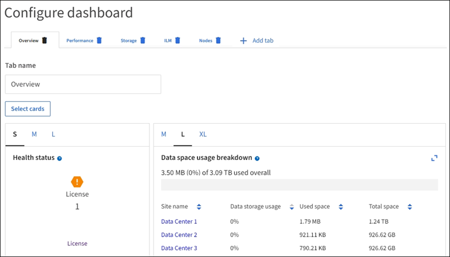

= View and manage the dashboard
:icons: font
:imagesdir: ../media/

[.lead]
You can use the dashboard to monitor system activities at a glance. You can create custom dashboards to monitor your implementation of StorageGRID.

NOTE: To change units for the storage values displayed in the Grid Manager, select the user drop-down in the upper right of the Grid Manager, then select *User preferences*.

image::../media/grid_manager_dashboard.png[Grid Manager dashboard]

== View the dashboard

The dashboard consists of tabs that contain specific information about the StorageGRID system. Each tab contains categories of information displayed on cards.

You can use the system-provided dashboard as is. Additionally, you can create custom dashboards that contain only the tabs and cards that are relevant to monitoring your implementation of StorageGRID.

The system-provided dashboard tabs contain cards with the following types of information:

[cols="1a,3a" options="header"]
|===
| Tab on system-provided dashboard| Contains

|Overview
|General information about the grid, such as active alerts, and total objects in the grid.

|Performance
|Space usage, storage used over time, S3 or Swift operations, request duration, error rate.

|Storage
|Tenant quota usage and logical space usage. Forecasts of space usage for user data and metadata.

|ILM
|Information lifecycle management queue and evaluation rate.

|Nodes
|CPU, data, and memory usage by node. S3 or Swift operations by node. Node to site distribution.
|===

Some of the cards can be maximized for easier viewing. Select the maximize icon image:../media/icon_dashboard_card_maximize.png[Maximize icon] in the upper right corner of the card. To close a maximized card, select the minimize icon image:../media/icon_dashboard_card_minimize.png[Minimize icon] or select *Close*.

== Manage dashboards

If you have Root Access (see link:../admin/admin-group-permissions.html[Admin group permissions]), you can perform the following management tasks for dashboards:

* Create a custom dashboard from scratch. You can use custom dashboards to control which StorageGRID information is displayed and how that information is organized.
* Clone a dashboard to create custom dashboards.
* Set an active dashboard for a user. The active dashboard can be the system-provided dashboard or a custom dashboard.
* Set a default dashboard, which is what all users see unless they activate their own dashboard.
* Edit a dashboard name.
* Edit a dashboard to add or remove tabs and cards. You can have a minimum of 1 and a maximum of 20 tabs.
* Remove a dashboard.

If you have any other permission besides Root Access, you can only set an active dashboard.

To manage dashboards, select *Actions* > *Manage dashboards*.

image::../media/dashboard_manage.png[Manage dashboards]

== Configure dashboards

To create a new dashboard by cloning the active dashboard, select *Actions* > *Clone active dashboard*.

To edit or clone an existing dashboard, select *Actions* > *Manage dashboards*. 

NOTE: The system-provided dashboard cannot be edited or removed.

When configuring a dashboard, you can:

* Add or remove tabs
* Rename tabs and give new tabs unique names
* Add, remove, or rearrange (drag and drop) cards for each tab
* Select the size for individual cards by selecting *S*, *M*, *L* or *XL* at the top of the card

