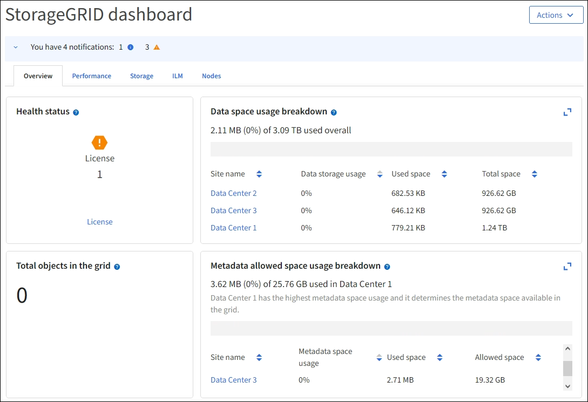

= View the Dashboard
:icons: font
:imagesdir: ../media/

[.lead]
You can use the Dashboard to monitor system activities at a glance. The Dashboard includes information about system health, usage metrics, and operational trends and charts.

== Configure the Dashboard

The Dashboard consists of tabs that contain specific information about the StorageGRID system. Each tab contains categories of information displayed on cards. As needed, you can select *Configure dashboard* to add or remove tabs or cards. Select the three vertical dots in the upper right corner of a card to perform operations such as resizing or removing the card.

== Available cards by category

NOTE: You can add a card to any tab you choose.

*Overview*

* Data usage breakdown
* Health status
* Metadata usage breakdown
* Storage over time
* Total objects
* Grid information

*Performance*

* Average request duration
* Error rate
* Network traffic
* Platform services - Pending requests
* Platform services - Failed requests
* Platform services - Request rate
* S3 API calls
* S3 operations

*Storage*

* Object count over time
* Object size distribution
* Site level metadata usage forecast
* Storage information
* Storage pool level data usage forecast
* Storage used by placement type
* Top 5 buckets by logical space used
* Top 5 tenants by logical space used
* Top 5 tenants by quota usage

*ILM*

* ILM queue
* ILM evaluation rate
* ILM information

*Nodes*

* Nodes by deployment type
* Node to site distribution
* Overall node health
* Top 5 nodes by alerts
* Top 5 nodes by CPU usage
* Top 5 nodes by data usage
* Top 5 nodes by memory usage
* Top 5 nodes by S3 operations
* Total nodes