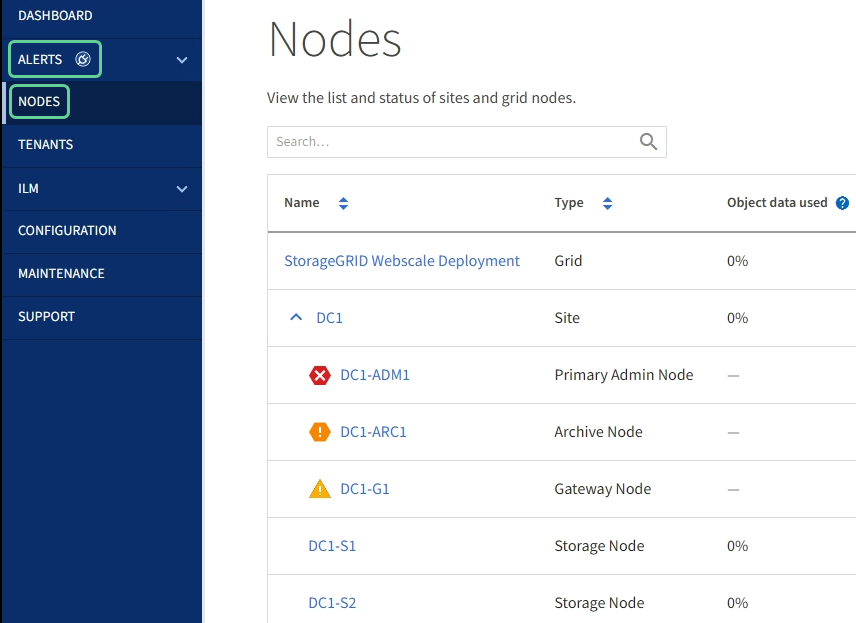

= View the Nodes page
:icons: font
:imagesdir: ../media/

[.lead]
When you need more detailed information about your StorageGRID system than the dashboard provides, you can use the Nodes page to view metrics for the entire grid, each site in the grid, and each node at a site.

IMPORTANT: When a node is not connected to the grid, such as during upgrade or a <<connection-state,disconnected state>>, it cannot accurately report certain metrics, such as "`available storage`" metrics. After a node reconnects to the grid, wait several minutes for the values to stabilize. 

NOTE: Support for Archive Nodes is deprecated and will be removed in a future release. Moving objects from an Archive Node to an external archival storage system through the S3 API has been replaced by ILM Cloud Storage Pools, which offer more functionality. The Cloud Tiering - Simple Storage Service (S3) option is now deprecated. +
If you are currently using an Archive Node with the Cloud Tiering - Simple Storage Service (S3) option, migrate your objects to a Cloud Storage Pool. See link:../ilm/index.html[Manage objects with ILM]. +
Addtionally, you should remove Archive Nodes from active ILM policies in StorageGRID 11.7 or earlier. Removing object data stored on Archive Nodes will simplify future upgrades. See link:../ilm/working-with-ilm-rules-and-ilm-policies.html[Working with ILM rules and ILM policies].

The Nodes table lists summary information for the entire grid, each site, and each node. If a node is disconnected or has an active alert, an icon appears next to the node name. If the node is connected and has no active alerts, no icon is shown.

NOTE: To change units for the storage values displayed in the Grid Manager, select the user drop-down in the upper right of the Grid Manager, then select *User preferences*.

[[connection-state]]
== Connection state icons

If a node is disconnected from the grid, either of the following icons appears next to the node name.

[cols="1a,3a,3a" options="header"]
|===
| Icon| Description| Action required

|image:../media/icon_alarm_blue_unknown.png[blue question mark icon]
|*Not connected - Unknown*

For an unknown reason, a node is disconnected or services on the node are unexpectedly down. For example, a service on the node might be stopped, or the node might have lost its network connection because of a power failure or unexpected outage.

The *Unable to communicate with node* alert might also be triggered. Other alerts might also be active.

|Requires immediate attention. link:monitoring-system-health.html#view-current-and-resolved-alerts[Select each alert] and follow the recommended actions.

For example, you might need to restart a service that has stopped or restart the host for the node.

*Note*: A node might appear as Unknown during managed shutdown operations. You can ignore the Unknown state in these cases.

|image:../media/icon_alarm_gray_administratively_down.png[gray questionmark icon]
|*Not connected - Administratively down*

For an expected reason, node is not connected to grid.

For example, the node, or services on the node, has been gracefully shut down, the node is rebooting, or the software is being upgraded. One or more alerts might also be active.

Based on the underlying issue, these nodes often go back online with no intervention.
|
Determine if any alerts are affecting this node.

If one or more alerts are active, link:monitoring-system-health.html#view-current-and-resolved-alerts[Select each alert] and follow the recommended actions.
|===

If a node is disconnected from the grid, it might have an underlying alert, but only the "`Not connected`" icon appears. To see the active alerts for a node, select the node.

== Alert icons

If there is an active alert for a node, one of the following icons appears next to the node name:

image:../media/icon_alert_red_critical.png[Icon Alert Red Critical] *Critical*: An abnormal condition exists that has stopped the normal operations of a StorageGRID node or service. You must address the underlying issue immediately. Service disruption and loss of data might result if the issue is not resolved.

image:../media/icon_alert_orange_major.png[Icon Alert Orange Major] *Major*: An abnormal condition exists that is either affecting current operations or approaching the threshold for a critical alert. You should investigate major alerts and address any underlying issues to ensure that the abnormal condition does not stop the normal operation of a StorageGRID node or service.

image:../media/icon_alert_yellow_minor.png[Icon Alert Yellow Minor] *Minor*: The system is operating normally, but an abnormal condition exists that could affect the system's ability to operate if it continues. You should monitor and resolve minor alerts that do not clear on their own to ensure they do not result in a more serious problem.

== View details for a system, site, or node

To filter the information shown in the Nodes table, enter a search string in the *Search* field. You can search by system name, display name, or type (for example, enter *gat* to quickly locate all Gateway Nodes). 

To view the information for the grid, site, or node:

* Select the grid name to see an aggregate summary of the statistics for your entire StorageGRID system.
* Select a specific data center site to see an aggregate summary of the statistics for all nodes at that site.
* Select a specific node to view detailed information for that node.