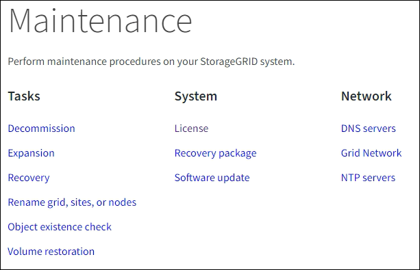
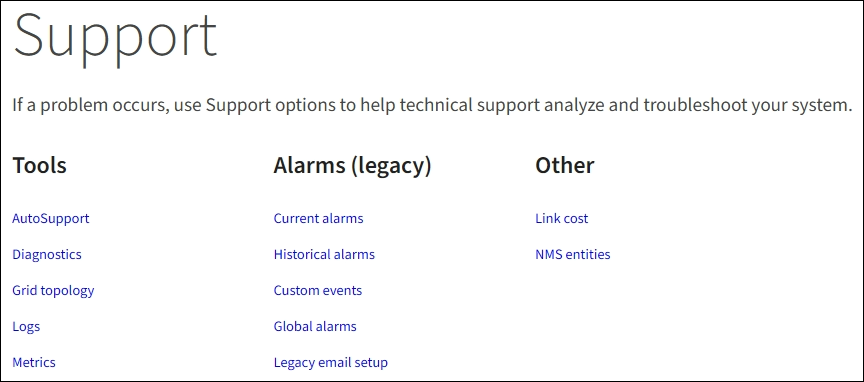

= Explore the Grid Manager
:icons: font
:imagesdir: ../media/

[.lead]
The Grid Manager is the browser-based graphical interface that allows you to configure, manage, and monitor your StorageGRID system.

When you sign in to the Grid Manager, you are connecting to an Admin Node. Each StorageGRID system includes one primary Admin Node and any number of non-primary Admin Nodes. You can connect to any Admin Node, and each Admin Node displays a similar view of the StorageGRID system.

You can access the Grid Manager using a xref:../admin/web-browser-requirements.adoc[supported web browser].

== Grid Manager dashboard

When you first sign in to the Grid Manager, you can use the dashboard to monitor system activities at a glance.

The dashboard contains information about system health and performance, storage use, ILM processes, S3 and Swift operations, and the nodes in the grid. You can xref:../monitor/viewing-dashboard.adoc[configure the dashboard] by selecting from a collection of cards that contain the information you need to effectively monitor your system.

image::../media/grid_manager_dashboard.png[Dashboard in the Grid Manager]

For an explanation of the information on each card, select the help icon image:../media/icon_nms_question.png[question mark icon] for that card.

.Learn more

* xref:../monitor/viewing-dashboard.adoc[View and configure the dashboard]

== Search field

The *Search* field in the header bar allows you to quickly navigate to a specific page within Grid Manager. For example, you can enter *km* to access the Key management server (KMS) page. You can use *Search* to find entries in the sidebar of the Grid Manager and on the Configuration, Maintenance, and Support menus. 

== Help menu

The help menu image:../media/icon-help-menu-bar.png[help icon on the menu bar] provides access to the FabricPool and S3 setup wizard, the StorageGRID documentation center for the current release, and the API documentation. You can also determine which version of StorageGRID is currently installed.

image::../media/help_menu.png[Help menu]

.Learn more

* xref:../fabricpool/use-fabricpool-setup-wizard.adoc[Use FabricPool setup wizard]
* xref:../admin/use-s3-setup-wizard.adoc[Use S3 setup wizard]
* xref:../admin/using-grid-management-api.adoc[Use the Grid Management API]

== Alerts menu

The Alerts menu provides an easy-to-use interface for detecting, evaluating, and resolving issues that might occur during StorageGRID operation.

image::../media/alerts_menu.png[Alerts Menu]

From the Alerts menu, you can do the following:

* Review current alerts
* Review resolved alerts
* Configure silences to suppress alert notifications
* Define alert rules for conditions that trigger alerts
* Configure the email server for alert notifications

.Learn more

* xref:../monitor/managing-alerts.adoc[Manage alerts]

== Nodes page

The Nodes page displays information about the entire grid, each site in the grid, and each node at a site.

The Nodes home page displays combined metrics for the entire grid. To view information for a particular site or node, select the site or node.

image::../media/nodes_menu.png[nodes page main]

.Learn more

* xref:../monitor/viewing-nodes-page.adoc[View the Nodes page]

== Tenants page

The Tenants page allows you to create and monitor the storage tenant accounts for your StorageGRID system. You must create at least one tenant account to specify who can store and retrieve objects and which functionality is available to them.

The Tenants page also provides usage details for each tenant, including the amount of storage used and the number of objects. If you set a quota when you created the tenant, you can see how much of that quota has been used.

image::../media/tenants_menu_and_page.png[Tenants Menu and Page]

.Learn more

* xref:../admin/managing-tenants.adoc[Manage tenants]

* xref:../tenant/index.adoc[Use a tenant account]

== ILM menu

The ILM menu allows you to configure the information lifecycle management (ILM) rules and policies that govern data durability and availability. You can also enter an object identifier to view the metadata for that object.

image::../media/ilm_menu_and_page.png[ILM Menu and Page]

.Learn more

* xref:using-information-lifecycle-management.adoc[Use information lifecycle management]

* xref:../ilm/index.adoc[Manage objects with ILM]

== Configuration menu

The Configuration menu allows you to specify network settings, security settings, system settings, monitoring options, and access control options.

image::../media/configuration_menu.png[Configuration Menu]

=== Network tasks

Network tasks include:

* xref:../admin/configuring-s3-api-endpoint-domain-names.adoc[Configuring S3 endpoint domain names]
* xref:../admin/managing-high-availability-groups.adoc[Managing high availability groups]
* xref:../admin/manage-link-costs.adoc[Managing link costs]
* xref:../admin/managing-load-balancing.adoc[Managing load balancing]
* xref:../admin/managing-traffic-classification-policies.adoc[Managing traffic classification policies]
* xref:../admin/configure-vlan-interfaces.adoc[Configuring VLAN interfaces]

=== Security tasks
Security tasks include:

* xref:../admin/using-storagegrid-security-certificates.adoc[Using security certificates]
* xref:../admin/kms-configuring.adoc[Configuring key management servers]
* Configuring the settings for a xref:../admin/configuring-storage-proxy-settings.adoc[Storage proxy] or an xref:../admin/configuring-admin-proxy-setting.adoc[Admin proxy] 
* Controlling firewall settings
* Grid passwords
* Security settings

=== System tasks
System tasks include:

* Managing display options
* Managing grid options
* xref:../ilm/managing-objects-with-s3-object-lock.adoc[Managing S3 Object Lock]
* xref:../admin/managing-storage-options.adoc[Managing Storage options]

=== Monitoring tasks

Monitoring tasks include:

* xref:../monitor/configure-audit-messages.adoc[Configuring audit messages and log destinations]
* xref:../monitor/using-snmp-monitoring.adoc[Using SNMP monitoring]

=== Access control tasks

Access control tasks include:

* xref:../admin/using-identity-federation.adoc[Using identity federation]
* xref:../admin/managing-admin-groups.adoc[Managing admin groups]
* xref:../admin/managing-users.adoc[Managing admin users]
* xref:../admin/configuring-sso.adoc[Configuring SSO]

== Maintenance menu

The Maintenance menu allows you to perform maintenance tasks, system maintenance, and network maintenance.

=== Tasks

Maintenance tasks include:

* xref:../maintain/decommission-procedure.adoc[Decommission operations] to remove unused grid nodes and sites
* xref:../expand/index.adoc[Expansion operations] to add new grid nodes and sites
* xref:../maintain/grid-node-recovery-procedures.adoc[Grid node recovery procedures] to replace a failed node and restore data
* xref:../maintain/rename-grid-site-node-overview.adoc[Rename procedures] to change the display names of your grid, sites, and nodes
* xref:../troubleshoot/verifying-object-integrity.adoc[Object existence check operations] to verify the existence (although not the correctness) of object data
* Volume restoration

=== System

System maintenance tasks you can perform include:

* xref:../admin/viewing-storagegrid-license-information.adoc[Viewing StorageGRID license information] or xref:../admin/updating-storagegrid-license-information.adoc[updating license information]
* Generating and downloading a xref:../maintain/downloading-recovery-package.adoc[Recovery Package]
* Performing StorageGRID software updates, including software upgrades, hotfixes, and updates to the SANtricity OS software on selected appliances

** xref:../upgrade/index.adoc[Upgrade procedure]
** xref:../maintain/storagegrid-hotfix-procedure.adoc[Hotfix procedure]
** xref:../sg6000/upgrading-santricity-os-on-storage-controllers-using-grid-manager-sg6000.adoc[Upgrade SANtricity OS on SG6000 storage controllers using Grid Manager]
** xref:../sg5700/upgrading-santricity-os-on-storage-controllers-using-grid-manager-sg5700.adoc[Upgrade SANtricity OS on SG5700 storage controllers using Grid Manager]

=== Network

Network maintenance tasks you can perform include:

* Configuring xref:../maintain/configuring-dns-servers.adoc[DNS servers]
* Updating 
xref:../maintain/updating-subnets-for-grid-network.adoc[Grid Network subnets]
* Configuring xref:../maintain/configuring-ntp-servers.adoc[NTP servers]

== Support menu

The Support menu provides options that help technical support analyze and troubleshoot your system. There are two parts to the Support menu: Tools and Alarms (legacy).

=== Tools

From the Tools section of the Support menu, you can:

* xref:../admin/configure-autosupport-grid-manager.adoc[Configure AutoSupport]
* xref:../monitor/running-diagnostics.adoc[Run diagnostics] on the current state of the grid
* xref:../monitor/viewing-grid-topology-tree.adoc[Access the Grid Topology tree] to view detailed information about grid nodes, services, and attributes
* xref:../monitor/collecting-log-files-and-system-data.adoc[Collect log files and system data]
* xref:../monitor/reviewing-support-metrics.adoc[Review support metrics]
+
IMPORTANT: The tools available from the *Metrics* option are intended for use by technical support. Some features and menu items within these tools are intentionally non-functional.

=== Alarms (legacy)

From the Alarms (legacy) section of the Support menu, you can review current, historical, and global alarms, set up custom events, and set up email notifications for legacy alarms. See xref:../monitor/managing-alarms.adoc[Manage alarms (legacy system)].

NOTE: While the legacy alarm system continues to be supported, the alert system offers significant benefits and is easier to use. 