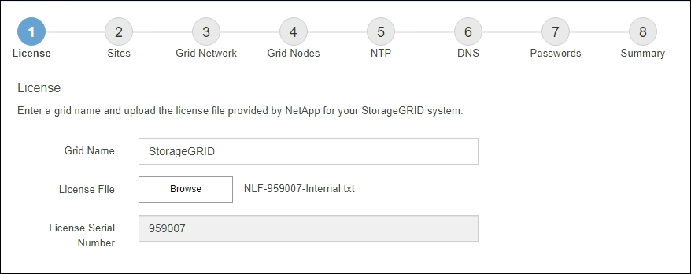

= Specify the StorageGRID license information
:icons: font
:imagesdir: ../media/

[.lead]
You must specify the name for your StorageGRID system and upload the license file provided by NetApp.

.Steps

. On the License page, enter a meaningful name for your StorageGRID system in the *Grid Name* field.
+
After installation, the name is displayed at the top of the Nodes menu.

. Select *Browse*, locate the NetApp license file (`NLF-_unique-id_.txt`), and select *Open*.
+
The license file is validated, and the serial number is displayed.
+
NOTE: The StorageGRID installation archive includes a free license that does not provide any support entitlement for the product. You can update to a license that offers support after installation.
+

. Select *Next*.
