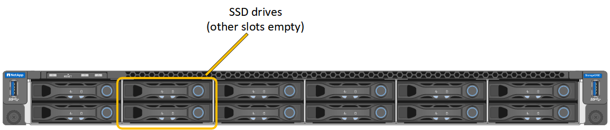

= Replace services appliance
:icons: font
:imagesdir: ../media/

[.lead]
You might need to replace the appliance if it is not functioning optimally or if it has failed.

.What you'll need

* You have a replacement appliance with the same part number as the appliance you are replacing.
* You have labels to identify each cable that is connected to the appliance.
* You have link:locating-controller-in-data-center.html[physically located the appliance].

.About this task

The StorageGRID node will not be accessible while you replace the appliance. If the appliance is functioning sufficiently, you can perform a controlled shutdown at the start of this procedure.

NOTE: If you are replacing the appliance before installing StorageGRID software, you might not be able to access the StorageGRID Appliance Installer immediately after completing this procedure. While you can access the StorageGRID Appliance Installer from other hosts on the same subnet as the appliance, you cannot access it from hosts on other subnets. This condition should resolve itself within 15 minutes (when any ARP cache entries for the original appliance time out), or you can clear the condition immediately by purging any old ARP cache entries manually from the local router or gateway.

.Steps
. Display the current configurations of the appliance and record them.
.. Log in to the appliance to be replaced:
  ... Enter the following command: `ssh admin@_grid_node_IP_`
  ... Enter the password listed in the `Passwords.txt` file.
  ... Enter the following command to switch to root: `su -`
  ... Enter the password listed in the `Passwords.txt` file.
+
When you are logged in as root, the prompt changes from `$` to `#`.
.. Enter: `*run-host-command ipmitool lan print*` to display the current BMC configurations for the appliance.

. Shut down the appliance: `shutdown -h now`
+
. If any of the network interfaces on this StorageGRID appliance are configured for DHCP, you may need to update the permanent DHCP lease assignments on the DHCP servers to reference the MAC addresses of the replacement appliance, to ensure the appliance is assigned the expected IP addresses. See link:../commonhardware/locate-mac-address.html[Update MAC address references]. 
 
. Remove and replace the appliance:
 .. Label the cables and then disconnect the cables and any network transceivers.
+
IMPORTANT: To prevent degraded performance, do not twist, fold, pinch, or step on the cables.
 .. Remove the failed appliance from the cabinet or rack.
 .. Transfer the two power supplies, eight cooling fans, and two SSDs from the failed appliance to the replacement appliance.
+
The two SSDs are placed in the slots as shown in the following diagram: 
+

+
HDD02 or HDD2 refer to the drive in the upper slot, and HDD03 or HDD3 refer to the drive in the lower slot.
+
Follow the instructions provided for replacing these components.

 .. Install the replacement appliance into the cabinet or rack.
 .. Replace the cables and any optical transceivers.
 .. Power on the appliance and wait for it to rejoin the grid.
 .. Confirm that the appliance node appears in the Grid Manager and that no alerts appear.
+
. Log in to the replaced appliance:
  .. Enter the following command: `ssh admin@_grid_node_IP_`
  .. Enter the password listed in the `Passwords.txt` file.
  .. Enter the following command to switch to root: `su -`
  .. Enter the password listed in the `Passwords.txt` file.
. Restore BMC network connectivity for the replaced appliance. There are two options: 
* Use static IP, netmask, and gateway 
* Use DHCP to obtain an IP, netmask, and gateway

.. To restore the BMC configuration to use a static IP, netmask, and gateway, enter the following commands:
+
`*run-host-command ipmitool lan set 1 ipaddr _Appliance_IP_*`
+
`*run-host-command ipmitool lan set 1 netmask _Netmask_IP_*`
+
`*run-host-command ipmitool lan set 1 defgw ipaddr _Default_gateway_*`

.. To restore the BMC configuration to use DHCP to obtain an IP, netmask, and gateway, enter the following command: 
+
`*run-host-command ipmitool lan set 1 ipsrc dhcp*`

. After restoring BMC network connectivity, connect to the BMC interface to audit and restore any additional custom BMC configuration you might have applied. For example, you should confirm the settings for SNMP trap destinations and email notifications. See link:../installconfig/configuring-bmc-interface.html[Configure BMC interface].
. Confirm that the appliance node appears in the Grid Manager and that no alerts appear.

include::../_include/fru-statement.adoc[]

.Related information

link:../installconfig/viewing-status-indicators.html[View status indicators]

link:../installconfig/viewing-boot-up-codes-for-appliance-sg100-and-sg1000.html[View boot-up codes for appliance]
