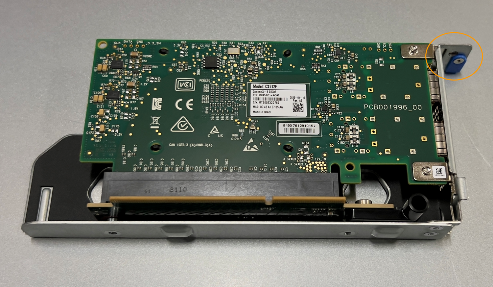

= Remove NIC in SGF6112
:icons: font
:imagesdir: ../media/

[.lead]
You might need to replace one of the Network Interface Cards (NICs) in the SGF6112 if it is not functioning optimally or if it has failed.

.What you'll need

* You have the correct replacement NIC.
* You have determined the location of the NIC to replace.
+
link:verifying-nic-to-replace.html[Verify component to replace]

* You have physically located the SGF6112 appliance where you are replacing the NIC in the data center.
+
link:locating-sgf6112-in-data-center.html[Locate appliance in data center]
+
NOTE: A link:shut-down-sgf6112.html[controlled shutdown of the appliance] is required before removing the appliance from the rack.

* You have disconnected all cables and removed the appliance cover.
+
link:removing-sgf6112-cover.html[Remove SGF6112 cover]

.About this task
To prevent service interruptions, confirm that all other Storage Nodes are connected to the grid before starting the NIC replacement or replace the NIC during a scheduled maintenance window when periods of service disruption are normally expected. See the information about link:../monitor/monitoring-node-connection-states.html[monitoring node connection states].

IMPORTANT: If you have ever used an ILM rule that creates only one copy of an object, you must replace the NIC during a scheduled maintenance window. Otherwise, you might temporarily lose access to those objects during this procedure. +
See information about link:../ilm/why-you-should-not-use-single-copy-replication.html[why you should not use single-copy replication].

.Steps

. Wrap the strap end of the ESD wristband around your wrist, and secure the clip end to a metal ground to prevent static discharge.
. Locate the riser assemblies at the rear of the appliance that contains the NIC.
+

The three NICs in the SGF6112 are in riser assemblies in the following positions in the chassis (Rear of SGF6112 with top cover removed shown): 

image::../media/sgf6112-nic-positions.png[NIC locations]

[options="header"]
|===
| | Device or Part name| Description
a|
1
a|
hic1/hic2
a|
10/25-GbE Ethernet network ports
a|
2
a|
mtc1/mtc2
a|
1/10GBase-T management ports
a|
3
a|
hic3/hic4
a|
10/25-GbE Ethernet network ports
a|
4
a|
Two-slot riser assembly
a|
Support for one of the 10/25-GbE NICs and the 1/10GBase-T NIC
a|
5
a|
One-slot riser assembly
a|
Support for one of the 10/25-GbE NICs
|===

. Grasp the riser assembly through the blue-marked holes and carefully lift it upwards. Move the riser assembly toward the front of the chassis as you lift it to allow the external connectors in its installed adapters to clear the chassis.
. Place the riser card on a flat anti-static surface with the metal frame side down to access the adapters.
+
* Two-slot riser assembly with two NICs
+
image::../media/two-slot-assembly-sgf6112.png[SGF6112 two NICs in two-slot riser assembly]
* One-slot riser assembly with one NIC
+

. Open the blue latch (circled) on the NIC to be replaced and carefully remove the NIC from the riser assembly. Rock the NIC slightly to help remove the NIC from its connector. Do not use excessive force.
. Place the NIC on a flat anti-static surface.

.After you finish

link:reinstalling-nic-in-sgf6112.html[Install the replacement NIC].

include::../_include/fru-statement.adoc[] 