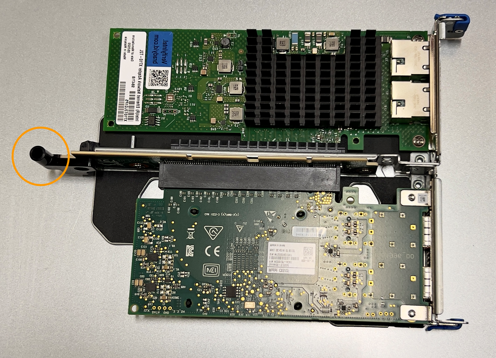

= Remove and replace NIC in the SGF6112
:icons: font
:imagesdir: ../media/

[.lead]
You might need to replace a Network Interface Card (NIC) in the SGF6112 if it is not functioning optimally or if it has failed.

Use these procedures to: 

* Remove the NIC
* Reinstall the NIC

== Remove the NIC

.What you'll need

* You have the correct replacement NIC.
* You have determined the location of the NIC to replace.
+
link:verify-component-to-replace.html[Verify component to replace]

* You have physically located the SGF6112 appliance where you are replacing the NIC in the data center.
+
link:locating-sgf6112-in-data-center.html[Locate appliance in data center]
+
NOTE: A link:shut-down-sgf6112.html[controlled shutdown of the appliance] is required before removing the appliance from the rack.

* You have disconnected all cables and removed the appliance cover.
+
link:reinstalling-sgf6112-cover.html[Remove SGF6112 cover]

.About this task
To prevent service interruptions, confirm that all other Storage Nodes are connected to the grid before starting the Network Interface Card (NIC) replacement or replace the NIC during a scheduled maintenance window when periods of service disruption are normally expected. See the information about link:../monitor/monitoring-system-health.html#monitor-node-connection-states[monitoring node connection states].

IMPORTANT: If you have ever used an ILM rule that creates only one copy of an object, you must replace the NIC during a scheduled maintenance window. Otherwise, you might temporarily lose access to those objects during this procedure. +
See information about link:../ilm/why-you-should-not-use-single-copy-replication.html[why you should not use single-copy replication].

.Steps

. Wrap the strap end of the ESD wristband around your wrist, and secure the clip end to a metal ground to prevent static discharge.
. Locate the riser assembly that contains the NIC at the rear of the appliance.
+

The three NICs in the SGF6112 are in two riser assemblies in the positions in the chassis shown in the photograph (Rear of SGF6112 with top cover removed shown): 
+
image::../media/sgf6112-nic-positions.jpg[NIC locations]

[options="header"]
|===
| | Device or Part name| Description
a|
1
a|
hic1/hic2
a|
10/25-GbE Ethernet network ports in the two-port riser assembly
a|
2
a|
mtc1/mtc2
a|
1/10GBase-T management ports in the two-port riser assembly
a|
3
a|
hic3/hic4
a|
10/25-GbE Ethernet network ports in the one-port riser assembly
a|
4
a|
Two-slot riser assembly
a|
Support for one of the 10/25-GbE NICs and the 1/10GBase-T NIC
a|
5
a|
One-slot riser assembly
a|
Support for one of the 10/25-GbE NICs
|===

. Grasp the riser assembly through the blue-marked holes and carefully lift it upwards. Move the riser assembly toward the front of the chassis as you lift it to allow the external connectors in its installed adapters to clear the chassis.
. Place the riser card on a flat anti-static surface with the metal frame side down to access the NICs.
+
* *Two-slot riser assembly with two NICs*
+

* *One-slot riser assembly with one NIC*
+
image::../media/one-slot-assembly-sgf6112.png[SGF6112 NIC in one-slot riser assembly]

. Open the blue latch (circled) on the NIC to be replaced and carefully remove the NIC from the riser assembly. Rock the NIC slightly to help remove the NIC from its connector. Do not use excessive force.
. Place the NIC on a flat anti-static surface.

== Reinstall the NIC
Install the replacement NIC into the same location as the one that was removed.

.What you'll need

* You have the correct replacement NIC.
* You have removed the existing failed NIC.

.Steps

. Wrap the strap end of the ESD wristband around your wrist, and secure the clip end to a metal ground to prevent static discharge.
. Remove the replacement NIC from its packaging.

. If you are replacing one of the NICs in the two-slot riser assembly, do the following:
.. Ensure the blue latch is in the open position.
.. Align the NIC with its connector on the riser assembly. Carefully press the NIC into the connector until it is fully seated as shown in the photograph and close the blue latch.
+

.. Locate the alignment hole on the two-slot riser assembly (circled) that aligns with a guide pin on the system board to ensure correct riser assembly positioning.
+

+
.. Locate the alignment pin on the system board 
+
image::../media/sgf6112_two-slot-riser_system-pin.png[System pin on SGF6112 for two-slot riser assembly]

.. Position the riser assembly in the chassis, making sure that it aligns with the connector on the system board and guide pin. 

.. Carefully press the two-slot riser assembly in place along its center line, next to the blue-marked holes, until it is fully seated.

. If you are replacing the NIC in the one-slot riser assembly, do the following: 
.. Ensure the blue latch is in the open position.
.. Align the NIC with its connector on the riser assembly. Carefully press the NIC into the connector until it is fully seated as shown in the photograph and close the blue latch.
+
image::../media/one-slot-assembly-sgf6112.png[SGF6112 on NIC in one-slot riser assembly]

.. Locate the alignment hole on the one-slot riser assembly (circled) that aligns with a guide pin on the system board to ensure correct riser assembly positioning.
+
image::../media/sgf6112_one-slot-riser_alignment_hole.png[Alignment hole on SGF6112 one-slot riser assembly]
+
.. Locate the alignment pin on the system board 
+

.. Position the one-slot riser assembly in the chassis, making sure that it aligns with the connector on the system board and guide pin. 

.. Carefully press the one-slot riser assembly in place along its center line, next to the blue-marked holes, until it is fully seated.

. Remove the protective caps from the NIC ports where you will be reinstalling cables.

.After you finish

If you have no other maintenance procedures to perform in the appliance, reinstall the appliance cover, return the appliance to the rack, attach cables, and apply power.

include::../_include/fru-statement.adoc[] 