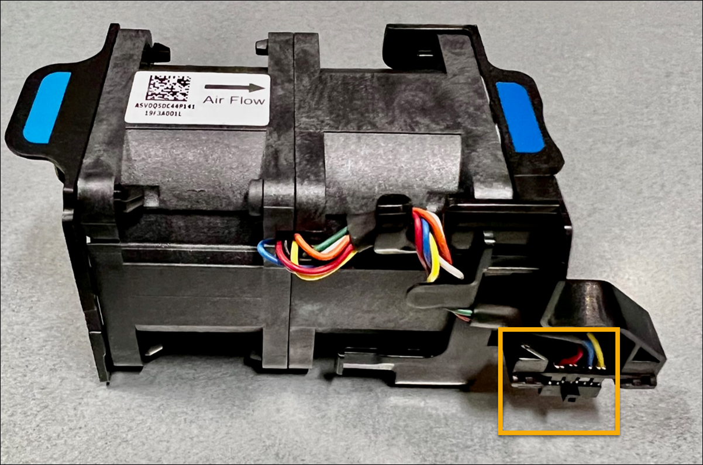
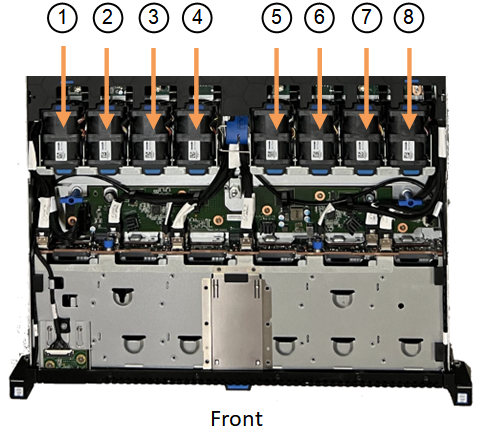
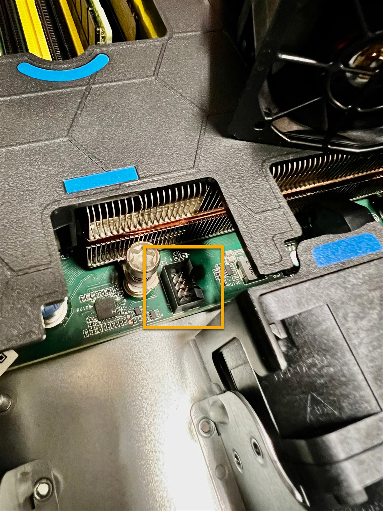

= Replace fan in an SGF6112 appliance
:icons: font
:imagesdir: ../media/

[.lead]
The SGF6112 appliance has eight cooling fans. If one of the fans fails, you must replace it as soon as possible to ensure that the appliance has proper cooling.

.What you'll need

* You have the correct replacement fan.
* You have determined the location of the fan to replace.
+
link:verify-component-to-replace.html[Verify component to replace]

* You have physically located the SGF6112 appliance where you are replacing the fan in the data center.
+
link:locating-sgf6112-in-data-center.html[Locate appliance in data center]
+
NOTE: A link:shut-down-sgf6112.html[controlled shutdown of the appliance] is required before removing the appliance from the rack.

* You have disconnected all cables and removed the appliance cover.
+
link:reinstalling-sgf6112-cover.html[Remove SGF6112 cover]

* You have confirmed that the other fans are installed and running.

.About this task
To prevent service interruptions, confirm that all other Storage Nodes are connected to the grid before starting the fan replacement or replace the fan during a scheduled maintenance window when periods of service disruption are normally expected. See the information about link:../monitor/monitoring-system-health.html#monitor-node-connection-states[monitoring node connection states].

IMPORTANT: If you have ever used an ILM rule that creates only one copy of an object, you must replace the fan during a scheduled maintenance window. Otherwise, you might temporarily lose access to those objects during this procedure. See information about link:../ilm/why-you-should-not-use-single-copy-replication.html[why you should not use single-copy replication].

The appliance node will not be accessible while you replace the fan.

The photograph shows a fan for the appliance. The electrical connector is highlighted. The cooling fans are accessible after you take the top cover off of the appliance.

NOTE: Each of the two power supply units also contain a fan. The power supply fans aren't included in this procedure.

.Steps
. Wrap the strap end of the ESD wristband around your wrist, and secure the clip end to a metal ground to prevent static discharge.
. Locate the fan that you need to replace.
+
The eight fans are in the following positions in the chassis (front half of SGF6112 with top cover removed shown): 
+

[options="header"]
|===
| | Fan unit 
a|
1
a|
Fan_SYS0
a|
2
a|
Fan_SYS1
a|
3
a|
Fan_SYS2
a|
4
a|
Fan_SYS3
a|
5
a|
Fan_SYS4
a|
6
a|
Fan_SYS5
a|
7
a|
Fan_SYS6
a|
8
a|
Fan_SYS7
|===
[start=3]
. Using the blue tabs on the fan, lift the failed fan out of the chassis.
+
image::../media/fan_removal.png[Fan Removal]

. Slide the replacement fan into the open slot in the chassis.
+
Be sure to align the connector on the fan with the socket in the circuit board.
+
. Press the fan's connector firmly into the circuit board (socket highlighted).
+

. Put the top cover back on the appliance, and press the latch down to secure the cover in place.
. Power on the appliance and monitor the appliance LEDs and boot-up codes.
+
Use the BMC interface to monitor boot-up status.

. Confirm that the appliance node appears in the Grid Manager and that no alerts appear.

include::../_include/fru-statement.adoc[] 
