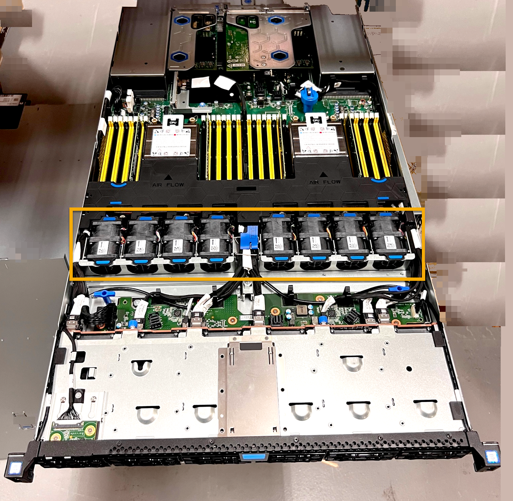

= Replace fan in an SGF6112 appliance
:icons: font
:imagesdir: ../media/

[.lead]
The SGF6112 appliance has eight cooling fans. If one of the fans fails, you must replace it as soon as possible to ensure that the appliance has proper cooling.

.What you'll need

* You have unpacked the replacement fan.
* You have xref:locating-sgf6112-in-data-center.adoc[physically located the appliance].
* You have confirmed that the other fans are installed and running.

.About this task

The appliance node will not be accessible while you replace the fan.

The photograph shows a fan for the appliance. The electrical connector is highlighted. The cooling fans are accessible after you take the top cover off of the appliance.

NOTE: Each of the two power supply units also contain a fan. The power supply fans are not included in this procedure.

image::../media/sgf6112_fan_fru.png[Fan SGF6112 FRU]

.Steps
. link:shut-down-sgf6112.html[Shut down the appliance].
. Pull the appliance out of the rack. 
. Lift the latch on the top cover and remove the cover from the appliance.
. Locate the fan that failed.
+

. Using the blue tabs on the fan, lift the failed fan out of the chassis.
+
image::../media/fan_removal.png[Fan Removal]

. Slide the replacement fan into the open slot in the chassis.
+
Be sure to align the connector on the fan with the socket in the circuit board.
+

. Press the fan's connector firmly into the circuit board (socket highlighted).
+
image::../media/sgf6112_fan_socket_check.png[Fan Connector Check]

. Put the top cover back on the appliance, and press the latch down to secure the cover in place.
. Power on the appliance and monitor the appliance LEDs and boot-up codes.
+
Use the BMC interface to monitor boot-up status.

. Confirm that the appliance node appears in the Grid Manager and that no alerts appear.

include::../_include/fru-statement.adoc[] 
