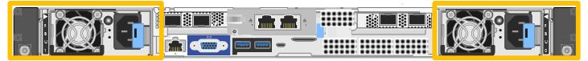

= Replace one or both power supplies in the SGF6112 appliance
:icons: font
:imagesdir: ../media/

[.lead]
The SGF6112 appliance has two power supplies for redundancy. If one of the power supplies fails, you must replace it as soon as possible to ensure that the appliance has redundant power. Both power supplies operating in the appliance must be of the same model and wattage.

.What you'll need

* You have link:locating-sgf6112-in-data-center.html[physically located the appliance] with the power supply to be replaced.

* You have link:verify-component-to-replace.html[determined the location of the power supply to replace].

* If you are replacing only one power supply:

** You have unpacked the replacement power supply unit and ensured that it is the same model and wattage as the power supply unit you are replacing. 

** You have confirmed that the other power supply is installed and running.

* If you are replacing both power supplies at the same time: 

** You have unpacked the replacement power supply units and ensured they are the same model and wattage.

.About this task

The figure shows the two power supply units for the SGF6112. The power supplies are accessible from the back of the appliance. 

.Steps

. If you are replacing only one power supply, you don't need to shut down the appliance. Go to the <<Unplug_the_power_cord,Unplug the power cord>> step. If you are replacing both power supplies at the same time, do the following before unplugging the power cords:

.. link:shut-down-sgf6112.html[Shut down the appliance].
+
IMPORTANT: If you have ever used an ILM rule that creates only one copy of an object and you are replacing both power supplies at the same time, you must replace the power supplies during a scheduled maintenance window. Otherwise, you might temporarily lose access to those objects during this procedure. See information about link:../ilm/why-you-should-not-use-single-copy-replication.html[why you should not use single-copy replication].

. [[Unplug_the_power_cord, start=2]]Unplug the power cord from each power supply to be replaced.
+
When viewed from the rear of the appliance, power supply A (PSU0) is on the right and power supply B (PSU1) is on the left. 
. Lift the handle on the first supply to be replaced.
+

image::../media/sg6000_cn_lift_cam_handle_psu.gif[Lifting the handle to remove PSU]

. Press the blue latch and pull the power supply out.
+

image::../media/sg6000_cn_remove_power_supply.gif[Removing a power supply]

. With the blue latch on the right, slide the replacement power supply into the chassis.

+
IMPORTANT: Both installed power supplies must be the same model and wattage.

+
Ensure that the blue latch is on the right side when you slide the replacement unit in.

+
You will feel a click when the power supply is locked into place. 

+
//update drawings
image::../media/sg6000_cn_insert_power_supply.gif[Sliding power supply in]

. Push the handle back down against the body of the PSU.

. If you are replacing both power supplies, repeat steps 2 though 6 to replace the second power supply. 
//update link
. link:../installconfig/connecting-power-cords-and-applying-power-sgf6112.html[Connect the power cords to the replaced units and apply power].

include::../_include/fru-statement.adoc[] 
