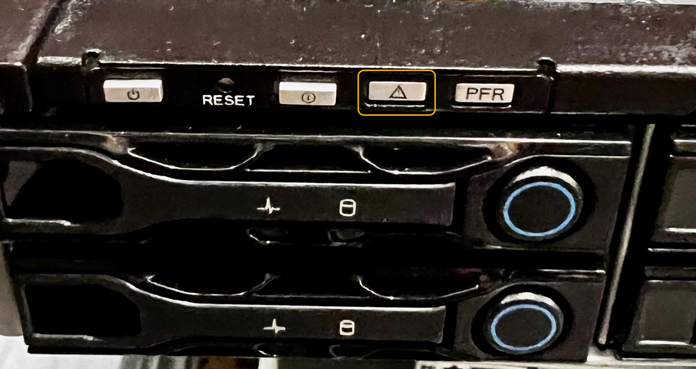

= Turn appliance identify LED on and off
:icons: font
:imagesdir: ../media/

[.lead]
The blue identify LED on the front and back of the appliance can be turned on to help locate the appliance in a data center.

.What you'll need

You have the BMC IP address of the appliance you want to identify.

.Steps

. Access the appliance BMC interface.
. Select *Server Identify*.
+
The current status of the identify LED is selected.
. Select *ON* or *OFF*, and then select *Perform Action*.
+
When you select *ON*, the blue identify LEDs light on the front (shown) and rear of the appliance.
+

+
NOTE: If a bezel is installed on the controller, it might be difficult to see the front identify LED.
+
. Turn the LED on and off as needed.

.Related information

link:locating-sgf6112-in-data-center.html[Locate appliance in data center]

link:../installconfig/accessing-bmc-interface.html[Access BMC interface]