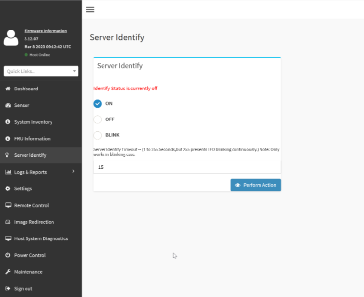

= Turn appliance identify LED on and off
:icons: font
:imagesdir: ../media/

[.lead]
The blue identify LED on the front and back of the appliance can be turned on to help locate the appliance in a data center.

.What you'll need

You must have the BMC IP address of the appliance you want to identify.

.Steps

. Access the appliance BMC interface.
. Select *Server Identify*.
. Select *ON* and then select *Perform Action*.
+

.Result

The blue identify LEDs light on the front (shown) and rear of the appliance.

image::../media/sgf6112_front_panel_service_led_on.png[Front identify LED - on]

NOTE: If a bezel is installed on the appliance, it might be difficult to see the front identify LED.

.After you finish

To turn off the appliance identify LED:

* Press the identify LED button on the appliance front panel.
* From the appliance BMC interface, select *Server Identify*, select *OFF* and then select *Perform Action*.

The blue identify LEDs on the front and rear of the appliance go off.

.Related information

link:locating-sgf6112-in-data-center.html[Locate appliance in data center]

link:../installconfig/accessing-bmc-interface.html[Access BMC interface]
