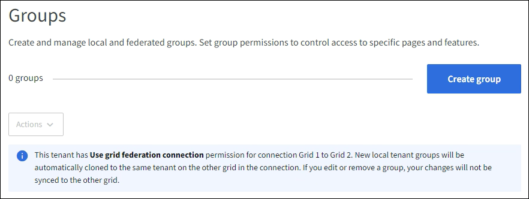

= Create groups for an S3 tenant
:icons: font
:imagesdir: ../media/

[.lead]
You can manage permissions for S3 user groups by importing federated groups or creating local groups.

.What you'll need
* You are signed in to the Tenant Manager using a link:../admin/web-browser-requirements.html[supported web browser].

* You belong to a user group that has the link:tenant-management-permissions.html[Root access permission].

* If you plan to import a federated group, you have link:using-identity-federation.html[configured identity federation], and the federated group already exists in the configured identity source.

* If your tenant account has the *Use grid federation connection* permission, you have reviewed the workflow and considerations for link:grid-federation-account-clone.html[cloning tenant groups and users], and you are signed in to the tenant's source grid.

== Access the Create group wizard

As your first step, access the Create group wizard.

.Steps

. Select *ACCESS MANAGEMENT* > *Groups*.

. If your tenant account has the *Use grid federation connection* permission, confirm that a blue banner appears, indicating that new groups created on this grid will be cloned to the same tenant on the other grid in the connection. If this banner does not appear, you might be signed in to the tenant's destination grid. 
+

. Select *Create group*.

== Choose a group type

You can create a local group or import a federated group.

.Steps

. Select the *Local group* tab to create a local group, or select the *Federated group* tab to import a group from the previously configured identity source.
+
If single sign-on (SSO) is enabled for your StorageGRID system, users belonging to local groups will not be able to sign in to the Tenant Manager, although they can use client applications to manage the tenant's resources, based on group permissions.

. Enter the group's name.

** *Local group*: Enter both a display name and a unique name. You can edit the display name later.
+
NOTE: If your tenant account has the *Use grid federation connection* permission, a cloning error will occur if the same *Unique name* already exists for the tenant on the destination grid.

** *Federated group*: Enter the unique name. For Active Directory, the unique name is the name associated with the `sAMAccountName` attribute. For OpenLDAP, the unique name is the name associated with the `uid` attribute.

. Select *Continue*.

== Manage group permissions

Group permissions control which tasks users can perform in the Tenant Manager and Tenant Management API.

.Steps

. For *Access mode*, select one of the following:
** *Read-write* (default): Users can sign in to Tenant Manager and manage the tenant configuration.
** *Read-only*: Users can only view settings and features. They can't make any changes or perform any operations in the Tenant Manager or Tenant Management API. Local read-only users can change their own passwords.
+
NOTE: If a user belongs to multiple groups and any group is set to Read-only, the user will have read-only access to all selected settings and features.

. Select one or more permissions for this group.
+
See link:../tenant/tenant-management-permissions.html[Tenant management permissions].

. Select *Continue*.

== Set S3 group policy

The group policy determines which S3 access permissions users will have.

.Steps

. Select the policy you want to use for this group.
+
[cols="1a,2a" options="header"]
|===
| Group policy
| Description

| No S3 Access
| Default. Users in this group don't have access to S3 resources, unless access is granted with a bucket policy. If you select this option, only the root user will have access to S3 resources by default.

| Read Only Access
| Users in this group have read-only access to S3 resources. For example, users in this group can list objects and read object data, metadata, and tags. When you select this option, the JSON string for a read-only group policy appears in the text box. You can't edit this string.

| Full Access
| Users in this group have full access to S3 resources, including buckets. When you select this option, the JSON string for a full-access group policy appears in the text box. You can't edit this string.

| Ransomware Mitigation
| This sample policy applies to all buckets for this tenant. Users in this group can perform common actions, but can't permanently delete objects from buckets that have object versioning enabled.

Tenant Manager users who have the *Manage all buckets* permission can override this group policy. Limit the Manage all buckets permission to trusted users, and use Multi-Factor Authentication (MFA) where available.

| Custom
| Users in the group are granted the permissions you specify in the text box.

|===

. If you selected *Custom*, enter the group policy. Each group policy has a size limit of 5,120 bytes. You must enter a valid JSON formatted string.
+
For detailed information about group policies, including language syntax and examples, see link:../s3/example-group-policies.html[Example group policies].

. If you are creating a local group, select *Continue*. If you are creating a federated group, select *Create group* and *Finish*. 

== Add users (local groups only)
You can save the group without adding users, or you can optionally add any local users that already exist.

NOTE: If your tenant account has the *Use grid federation connection* permission, any users you select when you create a local group on the source grid aren't included when the group is cloned to the destination grid. For this reason, don't select users when you create the group. Instead, select the group when you create the users.

.Steps

. Optionally, select one or more local users for this group.

. Select *Create group* and *Finish*.
+
The group you created appears in the list of groups.
+
If your tenant account has the *Use grid federation connection* permission and you are on the tenant's source grid, the new group is cloned to the tenant's destination grid. *Success* appears as the *Cloning status* in the Overview section of the group's detail page.