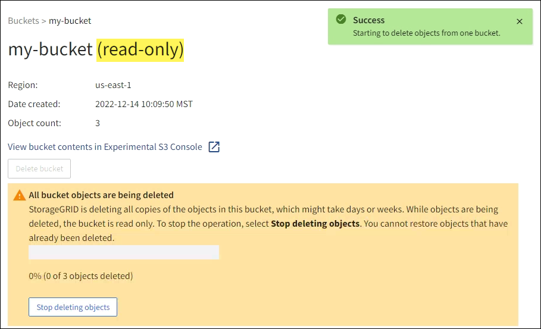
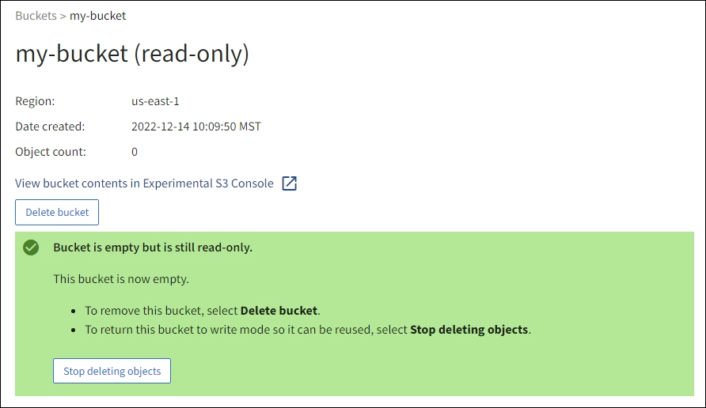

= Delete objects in bucket
:icons: font
:imagesdir: ../media/

[.lead]
You can use the Tenant Manager to delete the objects in one or more buckets.

.Considerations and requirements

Before performing these steps, note the following:

* When you delete the objects in a bucket, StorageGRID permanently removes all objects and all object versions in each selected bucket from all nodes and sites in your StorageGRID system. StorageGRID also removes any related object metadata. You will not be able to recover this information.

* Deleting all of the objects in a bucket might take minutes, days, or even weeks, based on the number of objects, object copies, and concurrent operations.

* If a bucket has link:using-s3-object-lock.html[S3 Object Lock enabled], it might remain in the *Deleting objects: read-only* state for _years_.
+
TIP: A bucket that uses S3 Object Lock will remain in the *Deleting objects: read-only* state until the retention date is reached for all objects and any legal holds are removed.

* While objects are being deleted, the bucket's state is *Deleting objects: read-only*. In this state, you can't add new objects to the bucket. 

* When all objects have been deleted, the bucket remains in the read-only state. You can do one of the following:

** Return the bucket to write mode and reuse it for new objects 
** Delete the bucket
** Keep the bucket in read-only mode to reserve its name for future use

* If a bucket has object versioning enabled, any delete markers that are in the bucket when you start these steps will not be removed by the delete objects operation. If you want to delete a versioned bucket after all objects have been deleted, you must remove any pre-existing delete markers.

* If you use link:grid-federation-manage-cross-grid-replication.html[cross-grid replication], note the following: 

** Using this option does not delete any objects from the bucket on the other grid.

** If you select this option for the source bucket, the *Cross-grid replication failure* alert will be triggered if you add objects to the destination bucket on the other grid. If you can't guarantee no one will add objects to the bucket on the other grid, link:../tenant/grid-federation-manage-cross-grid-replication.html[disable cross-grid replication] for that bucket before deleting all bucket objects.

.What you'll need

* You are signed in to the Tenant Manager using a link:../admin/web-browser-requirements.html[supported web browser].

* You belong to a user group that has the link:tenant-management-permissions.html[Root access permission]. This permission overrides the permissions settings in group or bucket policies.

.Steps

. Select *View buckets* from the dashboard, or select  *STORAGE (S3)* > *Buckets*.
+
The Buckets page appears and shows all existing S3 buckets.

. Use the *Actions* menu or the details page for a specific bucket.
+
[role="tabbed-block"]
====

.Actions menu
--
.. Select the check box for each bucket you want to delete objects from. 
.. Select *Actions* > *Delete objects in bucket*.

--

.Details page
--
.. Select a bucket name to display its details.
.. Select *Delete objects in bucket*.

--

====

. When the confirmation dialog box appears, review the details, enter *Yes*, and select *OK*.

. Wait for the delete operation to begin.
+
After a few minutes:

* A yellow status banner appears on the bucket details page. The progress bar represents what percentage of objects have been deleted.

* *(read-only)* appears after the bucket's name on the bucket details page.
* *(Deleting objects: read-only)* appears next to the bucket's name on the Buckets page.

+

. As required while the operation is running, select *Stop deleting objects* to halt the process. Then, optionally, select *Delete objects in bucket* to resume the process.
+
When you select *Stop deleting objects*, the bucket is returned to write mode; however, you can't access or restore any objects that have been deleted.

. Wait for the operation to complete.
+ 
When the bucket is empty, the status banner is updated, but the bucket remains read only.
+

. Do one of the following:

** Exit the page to keep the bucket in read-only mode. For example, you might keep an empty bucket in read-only mode to reserve the bucket name for future use.

** Delete the bucket. You can select *Delete bucket* to delete a single bucket or return the Buckets page and select *Actions* > *Delete* buckets to remove more than one bucket.
+
NOTE: If you are unable to delete a versioned bucket after all objects were deleted, delete markers might remain. To delete the bucket, you must remove all remaining delete markers.

** Return the bucket to write mode and optionally reuse it for new objects. You can select *Stop deleting objects* for a single bucket or return to the Buckets page and select *Action* > *Stop deleting objects* for more than one bucket. 

