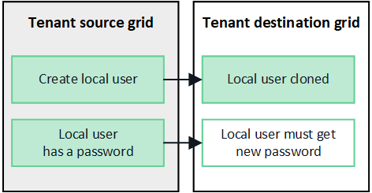
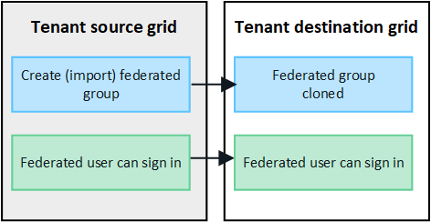

= Clone tenant groups and users
:icons: font
:imagesdir: ../media/

[.lead]
If a new tenant has permission to use a grid federation connection, that tenant is replicated from one StorageGRID system to another StorageGRID system when it is created. After the tenant has been replicated, any groups and users added to the source tenant are cloned to the destination tenant. 

The StorageGRID system where the tenant is originally created is the tenant's _source grid_. The StorageGRID system where the tenant is replicated is the tenant's _destination grid_. Both tenant accounts have the same account ID, name, description, storage quota, and assigned permissions, but the destination tenant does not initially have a root user password. For details, see link:../admin/grid-federation-what-is-account-clone.html[What is account clone] and link:../admin/grid-federation-manage-tenants.html[Manage permitted tenants]. 

The cloning of tenant account information is required for link:../admin/grid-federation-what-is-cross-grid-replication.html[cross-grid replication] of bucket objects. Having the same tenant groups and users on both grids ensures you can access the corresponding buckets and objects on either grid.

== Tenant workflow for account clone

If your tenant account has the *Use grid federation connection* permission, review the workflow diagram to see the steps you will perform to clone groups, users, and S3 access keys.

image:../media/grid-federation-account-clone-workflow-tm.png[the tenant's workflow for account clone. Steps are described in the following text.]

// Start snippet: Quick start headings as block titles
// 1 placeholder per entry: Heading text here

.image:https://raw.githubusercontent.com/NetAppDocs/common/main/media/number-1.png[One] Sign in to tenant

[role="quick-margin-para"]
Sign in to the tenant account on the source grid (the grid where the tenant was initially created.)

.image:https://raw.githubusercontent.com/NetAppDocs/common/main/media/number-2.png[Two] Optionally, configure identity federation for the tenant

[role="quick-margin-para"]
If your tenant account has the *Use own identity source* permission to use federated groups and users, configure the same identity source (with the same settings) for both the source and destination tenant accounts. Account cloning can't occur unless both grids have access to the same federated groups and users. For instructions, see link:using-identity-federation.html[Use identity federation]. 

.image:https://raw.githubusercontent.com/NetAppDocs/common/main/media/number-3.png[Three] Create groups and users

When creating groups and users, always start from the tenant's source grid. When you add a new group, StorageGRID automatically clones it to the destination grid.

[role="quick-margin-list"]
If identity federation is configured for the entire StorageGRID system or for your tenant account, link:creating-groups-for-s3-tenant.html[create new tenant groups] by importing federated groups from the identity source.

[role="quick-margin-list"]
If you aren't using identity federation,  link:creating-groups-for-s3-tenant.html[create new local groups] and then link:managing-local-users.html[create local users].

.image:https://raw.githubusercontent.com/NetAppDocs/common/main/media/number-4.png[Four] Create S3 access keys
You can link:creating-your-own-s3-access-keys.html[create your own access keys] or to link:creating-another-users-s3-access-keys.html[create another user's access keys] on either the source grid or the destination grid to access buckets on that grid. 

.image:https://raw.githubusercontent.com/NetAppDocs/common/main/media/number-5.png[Five] Optionally, clone S3 access keys
If the same user needs to access their buckets on both grids, create the access keys on the source grid and then use the Tenant Manager API to manually clone them to the destination grid. For instructions, see link:../tenant/grid-federation-clone-keys-with-api.html[Clone S3 access keys using the API].

== How are groups, users, and S3 access keys cloned?

Review this section to understand how groups, users, and S3 access keys are cloned between the tenant source grid and the tenant destination grid.

=== Local groups created on source grid are cloned

After a tenant account is created and replicated to the destination grid, StorageGRID automatically clones any local groups you add to the tenant's source grid to the tenant's destination grid.

Both the original group and its clone have the same access mode, group permissions, and S3 group policy. For instructions, see link:creating-groups-for-s3-tenant.html[Create groups for S3 tenant].

image:../media/grid-federation-account-clone.png[image showing that local groups are cloned from source grid to destination grid]

NOTE: Any users you add when creating a local group on the source grid are not included when the group is cloned to the destination grid. For this reason, do not select users when creating the group.

=== Local groups created on source grid are cloned

When you create a new local user on the source grid, StorageGRID automatically clones that user to the destination grid. Both the original user and its clone have the same full name, username, and *Deny access* setting, and both belong to the same groups. For instructions, see link:managing-local-users.html[Manage local users].

For security reasons, local user passwords are not cloned to the destination grid. If a local user needs to access Tenant Manager on the destination grid, the root user for the tenant account must add a password for that user on the destination grid. For instructions, see link:managing-local-users.html[Manage local users].

=== Federated groups created on source grid are cloned

Assuming the requirements for using account clone with link:../admin/grid-federation-what-is-account-clone.html#account-clone-sso[single sign-on] and link:../admin/grid-federation-what-is-account-clone.html#account-clone-identity-federation[identity federation] have been met, federated groups that you create (import) for the tenant on the source grid are automatically cloned to the tenant on the destination grid. 

Both groups have the same access mode, group permissions and S3 group policy.

After federated groups are created on the source grid and cloned to the destination grid, federated users can sign in to either grid.

=== S3 access keys can be manually cloned

StorageGRID does not automatically clone S3 access keys because security is improved by having different keys on each grid. 

To manage access keys on the two grids, you can do either of the following:

* If you don't need to use the same keys for each grid, you can link:creating-your-own-s3-access-keys.html[create your own access keys] or link:creating-another-users-s3-access-keys.html[create another user's access keys] on each grid.

* If you need to use the same keys on both grids, you can create keys on the source grid and then use the Tenant Manager API to manually link:../tenant/grid-federation-clone-keys-with-api.html[clone the keys] to the destination grid.

image:../media/grid-federation-s3-access-key.png[image showing that s3 access keys can be optionally cloned from source grid to destination grid]

=== Groups and users added to destination grid are not cloned

Cloning occurs only from the tenant's source grid to the tenant's destination grid. If you create or import groups and users on the tenant's destination grid, StorageGRID will not clone these items back the tenant's source grid. 

image:../media/grid-federation-account-not-cloned.png[image showing that details on destination grid are not cloned to source grid]

=== Edited or deleted groups and users are not cloned

Cloning occurs only when you create new groups and users.

If you edit or delete groups or users on either grid, your changes will not be cloned to the other grid. 

image:../media/grid-federation-account-clone-edit-delete.png[image showing that edited or deleted details are not cloned]

