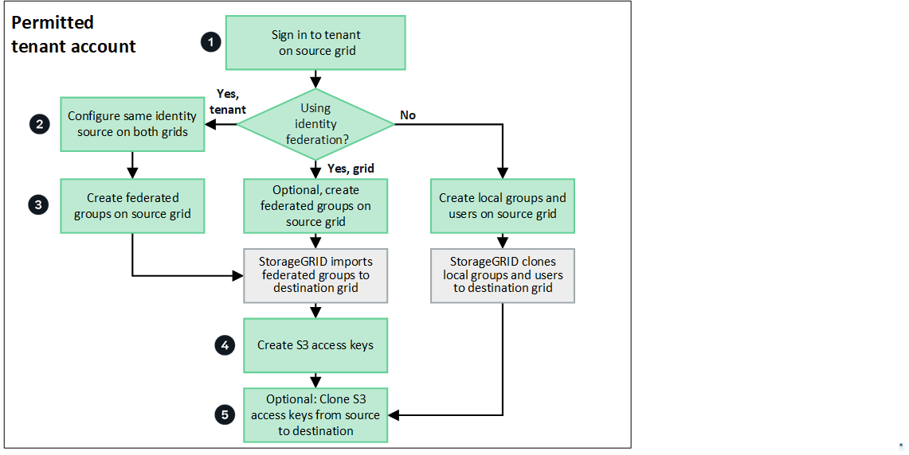

= Clone account information
:icons: font
:imagesdir: ../media/

[.lead]
If your tenant account was assigned the *Use grid federation connection* permission when it was created, tenant accounts, groups, users, and, optionally, S3 access keys are cloned from the tenant's source grid to the tenant's destination grid. 

Account cloning is required for cross-grid replication to ensure that the same tenant users and groups can access the corresponding buckets and objects on either grid.

The grid where the tenant is originally created is the tenant's _source grid_. The grid where the tenant is replicated is the tenant's _destination grid_. Both tenant accounts have the same account ID, name, description, storage quota, and assigned permissions, but the tenant replicated to the destination grid does not initially have a root user password.

For more details and requirements, go to:

* link:../admin/grid-federation-overview.html[What is grid federation]
* link:../admin/grid-federation-what-is-account-clone.html[What is account clone]
* link:../admin/grid-federation-what-is-cross-grid-replication.html[What is cross-grid replication]
* link:grid-federation-manage-cross-grid-replication.html[Manage cross-grid replication]

== Tenant workflow for account clone

The workflow diagram shows the steps that the users of a permitted tenant account will perform to clone account information. These steps are described in more detail below.

== Create permitted tenant in Grid Manager

Before account information can be cloned from one grid to another, a grid admin must create a new tenant account that has the *Use grid federation connection* permission for a specific grid federation connection. When the new tenant is saved on its source grid, StorageGRID automatically creates a replica of that tenant on its destination grid. For details, see link:../admin/grid-federation-manage-tenants.html[Manage permitted tenants].  

== Configure identity federation on both grids

If your tenant account has both the *Use grid federation connection* permission and the *Use own identity source* permission to use federated groups and users, you  must configure the same identity source (with the same settings) for both the source and destination tenant accounts. Account cloning can't occur unless both grids have access to the same federated groups and users. For instructions, see link:using-identity-federation.html[Use identity federation]. 

== Import federated groups and manage federated users

After identity federation is configured for the entire StorageGRID system or for your tenant account, you can create new tenant groups by importing federated groups from the identity source. When creating a federated group, always start from the tenant's source grid.

When you import a federated group on the source grid, StorageGRID automatically imports the same group to the replicated tenant on the destination grid. Both the original group and its clone have the same access mode, group permissions, and S3 group policy. For instructions, see link:creating-groups-for-s3-tenant.html[Create groups for S3 tenant].

After you create (import) a federated group on the source grid, federated users in the group can sign in to both the source and the destination grids.

== Create local groups and users

If you are not using identity federation, you can create new local groups and users. Always start from the tenant's source grid, and note the following:

* Always create local groups on the source grid before creating any local users you want to clone to the destination grid. 

* When you create a new local group on the source grid, StorageGRID automatically clones that group to the replicated tenant on the destination grid. Both the original group and its clone have the same access mode, group permissions, and S3 group policy. For instructions, see link:creating-groups-for-s3-tenant.html[Create groups for S3 tenant].
+
NOTE: Any users you add when creating a group on the source grid are not included when the group is cloned to the destination grid. For this reason, do not select users when creating the group.

* When you create a new local user on the source grid, StorageGRID automatically clones that user to the destination grid. Both the original user and its clone have the same full name, username, and *Deny access* setting, and both belong to the same groups. For instructions, see link:managing-local-users.html[Manage local users].

* For security reasons, local user passwords are not cloned to the destination grid.
+
TIP: If a local user needs to access Tenant Manager on the destination grid, the root user for the tenant account must add a password for that user on the destination grid. For instructions, see link:managing-local-users.html[Manage local users].

== Manage S3 access keys

To create S3 access keys, always start from the tenant's source grid. See the instructions to link:creating-your-own-s3-access-keys.html[create your own access keys] or to link:creating-another-users-s3-access-keys.html[create another user's access keys]. 

StorageGRID does not automatically clone S3 access keys to the tenant's destination grid because security is improved by having different keys on each grid. If a tenant user needs to access their buckets from both grids, use the Tenant Manager API to manually clone the keys from the source grid to the destination grid. For instructions, see link:../tenant/grid-federation-clone-keys-with-api.html[Clone S3 access keys using the API].

== Edit or delete tenant groups, users, or keys

Account cloning occurs only for new information. 

CAUTION: If you edit or delete a tenant or its users, groups, or access keys on either grid, your changes are not cloned to the other grid. 
If you delete a tenant on the destination grid, clone errors will occur if you attempt to create new groups or users on the tenant's source grid.

== Create groups, users, and keys on destination grid

Account cloning occurs only from the tenant's source grid to the tenant's destination grid. Although you can create groups, users, and S3 access keys on the tenant's destination grid, StorageGRID will not clone these items back the tenant's source grid. 

