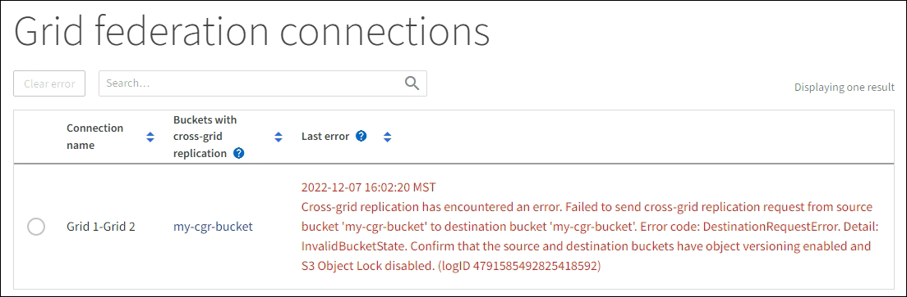

= View grid federation connections
:icons: font
:imagesdir: ../media/

[.lead]
If your tenant account has the *Use grid federation connection* permission, you can view the allowed connections.

.What you'll need

* The tenant account has the *Use grid federation connection* permission.
* You are signed in to the Tenant Manager using a link:../admin/web-browser-requirements.html[supported web browser].
* You belong to a user group that has the link:tenant-management-permissions.html[Root access permission].

.Steps

. Select *STORAGE (S3)* > *Grid federation connections*.
+
The Grid federation connection page appears, and includes a table that summarizes the following information:

* The *Connection name* column shows the grid federation connections this tenant has permission to use. 

* For each grid federation connection, the *Buckets with cross-grid replication* column lists all tenant buckets that have cross-grid replication enabled. Objects added to these buckets will be replicated to the other grid in the connection.

* For each grid federation connection, the *Last error* column shows the most recent error to occur, if any, when bucket data was being replicated to the other grid. This column shows only the last cross-grid replication error to occur for all tenant buckets; previous errors might have occurred for other buckets but will not be shown.
+
For example:
+

+
An error in this column might occur for one of these reasons:

** The source object version was not found.
** The source bucket was not found.
** The destination bucket was deleted.
** The destination bucket was re-created by a different account.	
** The destination bucket has versioning suspended.
** The destination bucket was re-created by the same account but is now unversioned.

. Optionally, select a bucket name to link:viewing-s3-bucket-details.html[view bucket details].

. If a message appears in the *Last error* column:
.. Review the text and perform any recommended actions.
.. Select the connection from the table.
.. Select *Clear error*.
.. Select *Yes* to clear the message and update the system's status.
.. Wait 5-6 minutes and then ingest a new object into the bucket. Confirm that the error message does not reappear.
+
NOTE: To ensure the error message is cleared, wait at least 5 minutes after the timestamp in the message before ingesting a new object.
+
IMPORTANT: After you clear an error for one bucket, a new *Last error* might appear after objects are ingested in a different bucket that also has an error. 

. To determine if any objects failed to be replicated because of the bucket error, see link:../admin/grid-federation-retry-failed-replication.html[Identify and retry failed replication operations]. 

