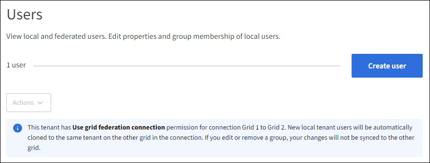

= Manage local users
:icons: font
:imagesdir: ../media/

[.lead]
You can create local users and assign them to local groups to determine which features these users can access. The Tenant Manager includes one predefined local user, named "`root.`" Although you can add and remove local users, you can't remove the root user.

NOTE: If single sign-on (SSO) is enabled for your StorageGRID system, local users will not be able to sign in to the Tenant Manager or the Tenant Management API, although they can use client applications to access the tenant's resources, based on group permissions.

.Before you begin

* You are signed in to the Tenant Manager using a link:../admin/web-browser-requirements.html[supported web browser].

* You belong to a user group that has the link:tenant-management-permissions.html[Root access permission].

* If your tenant account has the *Use grid federation connection* permission, you have reviewed the workflow and considerations for link:grid-federation-account-clone.html[cloning tenant groups and users], and you are signed in to the tenant's source grid.

== [[create-user]]Create a local user

You can create a local user and assign them to one or more local groups to control their access permissions.

S3 users who don't belong to any groups don't have management permissions or S3 group policies applied to them. These users might have S3 bucket access granted through a bucket policy.

Swift users who don't belong to any groups don't have management permissions or Swift container access.

=== Access the Create user wizard

.Steps

. Select *ACCESS MANAGEMENT* > *Users*.
+
If your tenant account has the *Use grid federation connection* permission, a blue banner indicates that this is the tenant's source grid. Any local users you create on this grid will be cloned to the other grid in the connection.
+

. Select *Create user*.

=== Enter credentials

.Steps

. For the *Enter user credentials* step, complete the following fields.
+
[cols="1a,3a" options="header"]
|===
| Field| Description

| Full name
| The full name for this user, for example, the first name and last name of a person or the name of an application. 

| Username
| The name this user will use to sign in. Usernames must be unique and can't be changed.

*Note*: If your tenant account has the *Use grid federation connection* permission, a cloning error will occur if the same *Username* already exists for the tenant on the destination grid.

| Password and Confirm password
| The password the user will initially use when signing in.

| Deny access
| Select *Yes* to prevent this user from signing in to the tenant account, even though they might still belong to one or more groups.

For example, select *Yes* to temporarily suspend a user's ability to sign in.

|===

. Select *Continue*.

=== Assign to groups

.Steps

. Assign the user to one or more local groups to determine which tasks they can perform. 
+
Assigning a user to groups is optional. If you'd prefer, you can select users when you create or edit groups. 
+
Users who don't belong to any groups will have no management permissions. Permissions are cumulative. Users will have all permissions for all groups they belong to. See link:tenant-management-permissions.html[Tenant management permissions].

. Select *Create user*.
+
If your tenant account has the *Use grid federation connection* permission and you are on the tenant's source grid, the new local user is cloned to the tenant's destination grid. *Success* appears as the *Cloning status* in the Overview section of the user's detail page.

. Select *Finish* to return to the Users page.

== View or edit local user

.Steps

. Select *ACCESS MANAGEMENT* > *Users*.

. Review the information provided on the Users page, which lists basic information for all local and federated users for this tenant account.
+
If the tenant account has the *Use grid federation connection* permission and you are viewing the user on the tenant's source grid, a blue banner indicates that if you edit or remove the user, your changes will not be synced to the other grid.

. If you want to change the user's full name:

.. Select the checkbox for the user.
.. Select  *Actions* > *Edit full name*.
.. Enter the new name.
.. Select *Save changes.*

. If you want to view more details or make additional edits, do either of the following:

** Select the username.

** Select the checkbox for the user, and select *Actions* > *View user details*.

. Review the Overview section, which shows the following information for each user:

** Full name
** Username
** User type
** Denied access
** Access mode
** Group membership
** Additional fields if the tenant account has the *Use grid federation connection* permission and you are viewing the user on the tenant's source grid:

*** Cloning status, either *Success* or *Failure*

*** A blue banner indicating that if you edit this user, your changes will not be synced to the other grid.

. Edit user settings as needed. See <<create-user,Create local user>> for details about what to enter.

.. In the Overview section, change the full name by selecting the name or the edit icon image:../media/icon_edit_tm.png[Edit icon].
+
You can't change the username.

.. On the *Password* tab, change the user's password, and select *Save changes*.

.. On the *Access* tab, select *No* to allow the user to sign in or select *Yes* to prevent the user from signing in. Then, select *Save changes*.

.. On the *Access keys* tab, select *Create key* and follow the instructions for link:creating-another-users-s3-access-keys.html[creating another user's S3 access keys]. 

.. On the *Groups* tab, select *Edit groups* to add the user to groups or remove the user from groups. Then, select *Save changes*.

. Confirm that you selected *Save changes* for each section you changed.

== Duplicate local user

You can duplicate a local user to create a new user more quickly.

NOTE: If your tenant account has the *Use grid federation connection* permission and you duplicate a user from the tenant's source grid, the duplicated user will be cloned to the tenant's destination grid.

.Steps

. Select *ACCESS MANAGEMENT* > *Users*.

. Select the checkbox for the user you want to duplicate.

. Select  *Actions* > *Duplicate user*.

. See <<create-user,Create local user>> for details about what to enter.

. Select *Create user*.

== Delete one or more local users

You can permanently delete one or more local users who no longer need to access the StorageGRID tenant account.

NOTE: If your tenant account has the *Use grid federation connection* permission and you delete a local user, StorageGRID will not delete the corresponding user on the other grid. If you need to keep this information in sync, you must delete the same user from both grids.

NOTE: You must use the federated identity source to delete federated users.

.Steps

. Select *ACCESS MANAGEMENT* > *Users*.

. Select the checkbox for each user you want to delete.

. Select *Actions* > *Delete user* or *Actions* > *Delete users*.
+
A confirmation dialog box appears.

. Select *Delete user* or *Delete users*.
