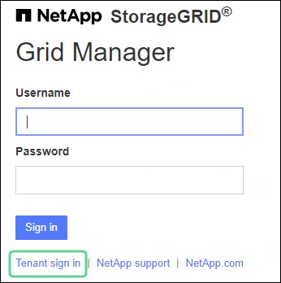
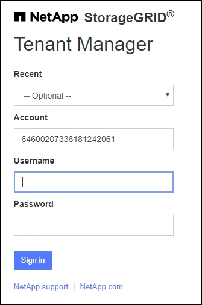
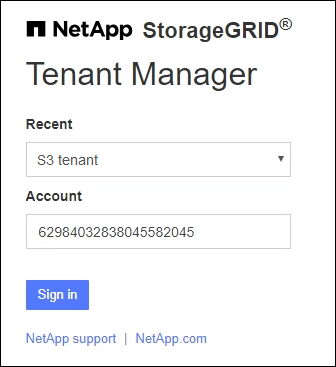

= Sign in to Tenant Manager
:icons: font
:imagesdir: ../media/

[.lead]
You access the Tenant Manager by entering the URL for the tenant into the address bar of a link:../admin/web-browser-requirements.html[supported web browser].

.Before you begin

* You have your login credentials.
* You have a URL for accessing the Tenant Manager, as supplied by your grid administrator. The URL will look like one of these examples:
+
`\https://FQDN_or_Admin_Node_IP/`
+
`\https://FQDN_or_Admin_Node_IP:port/`
+
`\https://FQDN_or_Admin_Node_IP/?accountId=20-digit-account-id`
+
`\https://FQDN_or_Admin_Node_IP:port/?accountId=20-digit-account-id`

+
The URL always includes a fully qualified domain name (FQDN), the IP address of an Admin Node, or the virtual IP address of an HA group of Admin Nodes. It might also include a port number, the 20-digit tenant account ID, or both.

* If the URL does not include the tenant's 20-digit account ID, you have this account ID.
* You are using a link:../admin/web-browser-requirements.html[supported web browser].
* Cookies are enabled in your web browser.
* You belong to a user group that has link:tenant-management-permissions.html[specific access permissions]. 

.Steps
. Launch a link:../admin/web-browser-requirements.html[supported web browser].
. In the browser's address bar, enter the URL for accessing Tenant Manager.
. If you are prompted with a security alert, install the certificate using the browser's installation wizard.
. Sign in to the Tenant Manager.
+
The sign-in screen that appears depends on the URL you entered and whether single sign-on (SSO) has been configured for StorageGRID.
+
[role="tabbed-block"]
====

.Not using SSO
--
If StorageGRID is not using SSO, one of the following screens appears:

* The Grid Manager sign-in page. Select the *Tenant sign-in* link.
+

* The Tenant Manager sign-in page. The *Account* field might already be completed, as shown below.
+

.. If the tenant's 20-digit account ID is not shown, select the name of the tenant account if it appears in the list of recent accounts, or enter the account ID.
.. Enter your username and password.
.. Select *Sign in*.
+
The Tenant Manager dashboard appears.

.. If you received an initial password from someone else, select *_username_* > *Change password* to secure your account.

--

.Using SSO
--
If StorageGRID is using SSO, one of the following screens appears:

* Your organization's SSO page. For example:
+
image::../media/sso_organization_page.gif[example organization Sign In page for SSO]
+
Enter your standard SSO credentials, and select *Sign in*.

* The Tenant Manager SSO sign-in page.
+

.. If the tenant's 20-digit account ID is not shown, select the name of the tenant account if it appears in the list of recent accounts, or enter the account ID.
.. Select *Sign in*.
.. Sign in with your standard SSO credentials on your organization's SSO sign-in page.
+
The Tenant Manager dashboard appears.

--

====

