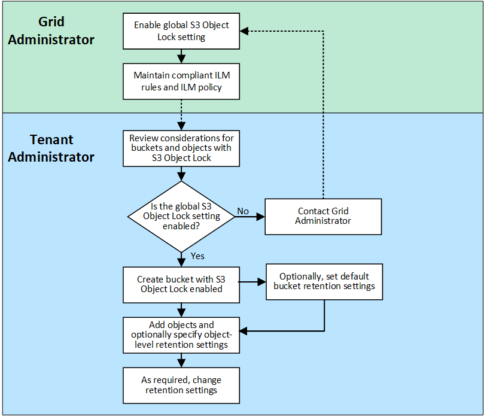

= Use S3 Object Lock to retain objects
:icons: font
:imagesdir: ../media/

[.lead]
You can use S3 Object Lock if buckets and objects must comply with regulatory requirements for retention.

include::../_include/s3-object-lock-what-is.adoc[]

== S3 Object Lock workflow

The workflow diagram shows the high-level steps for using the S3 Object Lock feature in StorageGRID.

Before you can create buckets with S3 Object Lock enabled, the grid administrator must enable the global S3 Object Lock setting for the entire StorageGRID system. The grid administrator must also ensure that the information lifecycle management (ILM) policy is "`compliant`"; it must meet the requirements of buckets with S3 Object Lock enabled. For details, contact your grid administrator or see the instructions for link:../ilm/managing-objects-with-s3-object-lock.html[manage objects with S3 Object Lock].

After the global S3 Object Lock setting has been enabled, you can create buckets with S3 Object Lock enabled and optionally specify default retention settings for each bucket. In addition, you can use the S3 client application to optionally specify retention settings for each object version.

include::../_include/s3-object-lock-requirements.adoc[]

== Can I still manage legacy Compliant buckets?

The S3 Object Lock feature replaces the Compliance feature that was available in previous StorageGRID versions. If you created compliant buckets using a previous version of StorageGRID, you can continue to manage the settings of these buckets; however, you can no longer create new compliant buckets. For instructions, see 
https://kb.netapp.com/Advice_and_Troubleshooting/Hybrid_Cloud_Infrastructure/StorageGRID/How_to_manage_legacy_Compliant_buckets_in_StorageGRID_11.5[NetApp Knowledge Base: How to manage legacy Compliant buckets in StorageGRID 11.5^].

